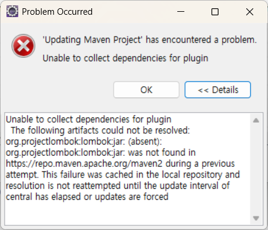

reference : https://velog.io/@yedam_it/springboot-프로젝트    

### 스프링부트 버전

||||||||
| :-------: | :--: |:--:| :--: | :---: | :---: | :--: |
|spring boot|spring|java|gradle|maven  |servlet|tomcat|
|3.0.13     |6.0.14|17  |7.5   |3.5    |6.0    |10    |
|2.7.18     |5.3.31|8   |6.8   |3.5    |4.0    |9     |
||||||||

- spring Boot3 = Java 17 이상(21 권장), Spring 6  
- Spring Boot2 = Java 8 이상, Spring 5  

- reference : https://docs.gradle.org/current/userguide/compatibility.html#java  

### 개발, 테스트, 운영 환경에 맞게 다중 프로파일 설정

- `.gitignore`에 **`*.properties`** 추가


#### 1. 개발환경에 맞게 프로퍼티 파일 준비

> application-`{profile}`.properties

> src/main/resources/  
	├── application.properties  (기본 설정 파일)  
	├── application-`local`.properties  (로컬 개발 환경 : 각 개발자 PC에서 개발 및 테스트 환경 설정)  
	├── application-`dev`.properties  (개발 환경 : 개발자들이 만든 코드를 통합하여 테스트 할 수 있는 서버 환경)  
	├── application-`test`.properties  (테스트 환경)  
	├── application-`prod`.properties  (운영 환경 : production - 실제 서비스를 운영하는 환경)  


#### 2. 적용할 프로퍼티 지정
- application.properties 파일에 활성 프로파일을 dev로 지정

```properties
spring.profiles.active=dev
```

- 운영환경에서 실행할 때 JVM 옵션으로 프로파일 지정
```sh
java -jar  XXX.jar  --spring.profiles.active=prod     # application.properties 적용됨
java -jar -Dspring.profiles.active=prod    XXX.jar    # application-dev.properties 적용됨
```

- 환경변수로 프로파일 설정

```sh
export SPRING_PROFILES_ACTIVE=prod
```

- Kubernetes 또는 Docker에서 지정  
Docker Compose 예제  
```yaml
version: '3'
services:
  myapp:
    image: myapp:latest
    environment:
      - SPRING_PROFILES_ACTIVE=prod
```

Kubernetes ConfigMap 예제  
```yaml
apiVersion: v1
kind: ConfigMap
metadata:
  name: myapp-config
data:
  SPRING_PROFILES_ACTIVE: "prod"
```


#### 3. 프로퍼티를 코드에서 사용

- JAVA 코드에서 사용  
```java
	@Value("${file.uploadpath}")
	String uploadpath;
```

- html에서 직접 접근하기  
```html
<span th:text="${@environment.getProperty('spring.profiles.active')}"></span>
```

- @ConfigurationProperties로 프로퍼티 설정  
여러 설정 값을 한 번에 객체로 매핑  

```java
@ConfigurationProperties(prefix = "server")
public class ServerConfig {
    private int port;
}
```

```java
@Configuration
@ConfigurationProperties(prefix = "spring.datasource")
public class DataSourceConfig {
    private String url;
    private String username;
    private String password;

    // Getters and Setters
}
```
application-{profile}.properties에 있는 spring.datasource.url, username, password 값이 자동으로 매핑  


#### 4. YAML을 사용한 다중 프로파일 설정  
```yaml
# application.yml
spring:
  profiles:
    active: dev
server:
  port: 81

---
spring:
  config:
    activate:
      on-profile: dev
server:
  port: 82

---
spring:
  config:
    activate:
      on-profile: prod 
server:
  port: 83
```
이렇게 설정하면 dev 프로파일이 활성화되었을 때 82 포트를 사용하고, prod가 활성화되면 83 포트를 사용  


#### 6. Spring Boot에서 설정 파일이 로드되는 우선순위

1. application-{profile}.properties (환경별 프로퍼티)
2. application.properties (기본 프로퍼티)
3. 환경 변수(Environment Variables)
4. JVM 옵션(-Dspring.profiles.active=prod)

즉, 환경 변수나 JVM 옵션이 가장 우선순위가 높고, 기본 application.properties가 가장 낮은 우선순위를 가짐.  


### 외부 경로의 리소스(업로드폴더) 접근
```java
import java.util.concurrent.TimeUnit;
import org.springframework.http.CacheControl;
import org.springframework.web.servlet.config.annotation.ResourceHandlerRegistry;
import org.springframework.web.servlet.config.annotation.WebMvcConfigurer;

@Configuration
public class ResourceConfiguration implements WebMvcConfigurer {

    @Value("${file.uploadpath}")
    String uploadpath;
    
    @Override
    public void addResourceHandlers(final ResourceHandlerRegistry registry) {
	
      registry.addResourceHandler("/img/**")
              .addResourceLocations("file://" + uploadpath + "/")      
              // 접근 파일 캐싱 시간 
             .setCacheControl(CacheControl.maxAge(1, TimeUnit.MINUTES));
    }
}
```


### rombok 업데이트 에러

에러메시지  
  
Unable to collect dependencies for plugin
org.projectlombok:lombok:jar: was not found in https://repo.maven.apache.org/maven2 during a previous attempt. This failure was cached in the local repository and resolution is not reattempted until the update interval of central has elapsed or updates are forced

조치방법  
build > plugin > annotationProcessorPaths > path에 lombok 버전을 지정함

```xml
<lombok.version>1.18.36</lombok.version>
<version>${lombok.version}</version>
```

```xml
	<properties>
		<java.version>17</java.version>
		<lombok.version>1.18.36</lombok.version>
	</properties>
  	<build>
		<plugins>
			<plugin>
				<groupId>org.apache.maven.plugins</groupId>
				<artifactId>maven-compiler-plugin</artifactId>
				<configuration>
					<annotationProcessorPaths>
						<path>
							<groupId>org.projectlombok</groupId>
							<artifactId>lombok</artifactId>
							<version>${lombok.version}</version>
						</path>
					</annotationProcessorPaths>
				</configuration>
			</plugin>
			<plugin>
				<groupId>org.springframework.boot</groupId>
				<artifactId>spring-boot-maven-plugin</artifactId>
				<configuration>
					<excludes>
						<exclude>
							<groupId>org.projectlombok</groupId>
							<artifactId>lombok</artifactId>
							<version>${lombok.version}</version>
						</exclude>
					</excludes>
				</confi
				guration>
			</plugin>
		</plugins>
	</build>
```


## -parameters 에러
에러  
java.lang.IllegalArgumentException: Name for argument of type [java.lang.String] not specified, and parameter name information not available via reflection. Ensure that the compiler uses the '-parameters' flag.
@RequestParam, @PathVariable, @Autowired, @ConfigurationProperties 어노테이션 사용 시 문제가 발생

💡 해결책  
Spring boot 3.2 부터 자바 컴파일러에 '-parameters' 옵션을 넣어야 애노테이션 이름을 생략할 수 있음

원인    
referer : https://mangkyu.tistory.com/376  

LocalVariableTableParameterNameDiscoverer 클래스는 스프링 6.0에서 deprecated 되었고, 6.1에서 최종 삭제

스프링 부트 3.0(스프링 6.0에서 deprecated)  
스프링 부트 3.1(스프링 6.0에서 deprecated)  
스프링 부트 3.2(스프링 6.1에서 removed)  

LocalVariableTableParameterNameDiscoverer  ==>  StandardReflectionParameterNameDiscoverer  

참고  
-parameters  
Generates metadata for reflection on method parameters. Stores formal parameter names of constructors and methods in the generated class file so that the method java.lang.reflect.Executable.getParameters from the Reflection API can retrieve them.

- gradle
  
```groovy
compileJava {	
	options.compilerArgs << '-parameters'
}
```

```groovy
tasks.withType(JavaCompile) {
    options.compilerArgs.add("-parameters")
}
```

```groovy
tasks.withType(JavaCompile) {
    options.compilerArgs << "-parameters"
}
```
```xml
<plugin>
    <groupId>org.apache.maven.plugins</groupId>
    <artifactId>maven-compiler-plugin</artifactId>
    <configuration>
        <parameters>true</parameters>
    </configuration>
</plugin>
```


## WebMvcConfigurer  인터페이스 (🔗)[https://docs.spring.io/spring-framework/docs/current/javadoc-api/org/springframework/web/servlet/config/annotation/WebMvcConfigurer.html]

@EnableWebMvc를 통해 활성화된 Spring MVC에 대한 Java 기반 구성을 사용자 정의하기 위한 콜백 메서드를 정의합니다.   
WebMvcConfigurer는 Spring MVC의 설정을 커스터마이징할 수 있는 인터페이스입니다. 
Spring Boot에서 제공하는 기본 설정을 유지하면서 특정 설정을 오버라이드하고 싶을 때 사용됩니다.  

|메서드	|설명 |
|:---|:----|
|addCorsMappings|	CORS 설정 추가|
|addInterceptors|	요청을 가로채는 인터셉터 추가|
|addResourceHandlers|	정적 리소스 경로 설정|
|addViewControllers|	URL과 View 연결|
|configureContentNegotiation|	응답의 Content-Type 설정|
|configureMessageConverters|	HTTP 메시지 변환기 추가|
|extendMessageConverters|	기본 메시지 변환기 설정 확장|
|configureAsyncSupport|	비동기 요청 설정|
|||

### CORS 설정
전역 크로스 오리진 요청 처리를 구성.  컨트롤러의 @CrossOrigin을 통해 더욱 세분화된 구성을 선언할 수 있고 컨트롤러의 메서드에 정의된 로컬 CORS 구성과 결합됩니다.  

```java
@Override
public void addCorsMappings(CorsRegistry registry) {
    registry.addMapping("/**") // 모든 경로에 대해 적용
            .allowedOrigins("https://example.com") // 특정 도메인 허용
            .allowedMethods("GET", "POST", "PUT", "DELETE") // 허용할 HTTP 메서드
            .allowCredentials(true);
}
```

### Interceptor 추가
```java
@Override
public void addInterceptors(InterceptorRegistry registry) {
    registry.addInterceptor(new MyInterceptor())
            .addPathPatterns("/api/**") // 특정 경로만 적용
            .excludePathPatterns("/api/auth/**"); // 인증 관련 API는 제외
}
```

### 정적 리소스 경로 설정
```java
@Override
public void addResourceHandlers(ResourceHandlerRegistry registry) {
    registry.addResourceHandler("/static/**")
            .addResourceLocations("classpath:/static/")
            .setCachePeriod(3600); // 캐시 유지 시간 (초)
}
```

### URL 과 view 매핑
```java
@Override
public void addViewControllers(ViewControllerRegistry registry) {
    registry.addViewController("/home").setViewName("home");
}
```

### 응답의 Content-Type을 설정
```java
@Override
public void configureContentNegotiation(ContentNegotiationConfigurer configurer) {
    configurer.favorParameter(true)
              .parameterName("format")
              .defaultContentType(MediaType.APPLICATION_JSON)
              .mediaType("xml", MediaType.APPLICATION_XML)
              .mediaType("json", MediaType.APPLICATION_JSON);
}
```

### HTTP 메시지 변환기 추가 또는 설정
```java
@Override
public void configureMessageConverters(List<HttpMessageConverter<?>> converters) {
    converters.add(new MappingJackson2HttpMessageConverter()); // JSON 변환기 추가
}
```

### 메시지 변환기에 추가 설정
```java
@Override
public void extendMessageConverters(List<HttpMessageConverter<?>> converters) {
    for (HttpMessageConverter<?> converter : converters) {
        if (converter instanceof MappingJackson2HttpMessageConverter) {
            ((MappingJackson2HttpMessageConverter) converter).setPrettyPrint(true);
        }
    }
}
```

### 비동기 요청 설정
```java
@Override
public void configureAsyncSupport(AsyncSupportConfigurer configurer) {
    configurer.setDefaultTimeout(5000) // 5초 후 타임아웃
              .registerCallableInterceptors(new MyCallableInterceptor());
}
```


## 인터셉터(Interceptor)
인터셉터는 특정 URI 패턴에 대한 요청을 가로채어 컨트롤러가 처리하기 전후에 추가적인 작업을 할 수 있게 해준다. 로그인 체크, 권한 검증, 로깅 등과 같은 작업을 처리할 수 있다.

동작과정  
1. 클라이언트의 요청을 가로챈다
2. 요청에 대해 전처리를 수행한다.
3. 처리가 끝난 후 원래의 목적지인 컨트롤러 전달한다.
4. 컨트롤러가 응답을 반환하면 응답을 가로챈다.
5. 응답에 대해 후처리를 수행한 후 응답을 클라이언트로 전달한다.

구현과정  
1. HandlerInterceptor 인터페이스 구현 :  preHandler()와 postHandler() 오버라이딩
2. WebMvcConfigurer 인터페이스 구현 : addIntercpetors() 오버라이딩


HandlerInterceptor 인터페이스 구현  
```java
@Slf4j
public class LoggerInterceptor implements HandlerInterceptor {

    @Override
    public boolean preHandle(HttpServletRequest request, HttpServletResponse response, Object handler) throws Exception {
        log.debug("==================== BEGIN ====================");
        log.debug("Request URI ===> " + request.getRequestURI());
        return HandlerInterceptor.super.preHandle(request, response, handler);
    }

    @Override
    public void postHandle(HttpServletRequest request, HttpServletResponse response, Object handler, ModelAndView modelAndView) throws Exception {
        log.debug("==================== END ======================");
        HandlerInterceptor.super.postHandle(request, response, handler, modelAndView);
    }

}
```

 
