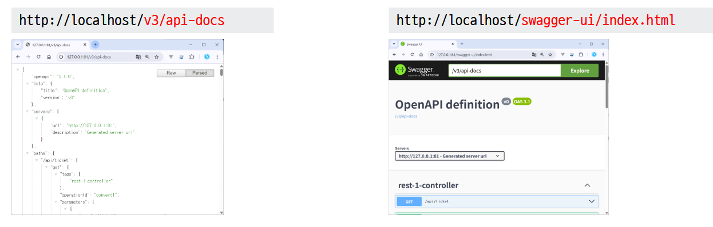
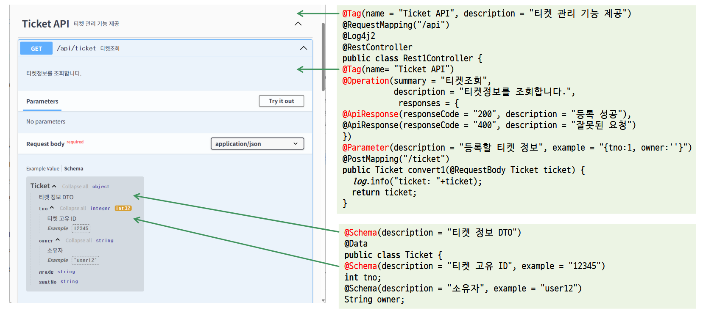

# 컨트롤러

## MVC 페턴

화면과 데이터 처리를 분리해서 재사용이 가능하도록 하는 구조  


- Model : 데이터 혹은 데이터를 처리하는 영역
- View : 결과화면을 만들어 내는데 사용하는 자원
- Controller : 웹의 요청(request)를 받아서 뷰와 모델 사이의 중간통신 역할

## 컨트롤러 애너테이션

Spring MVC Controller 주요 애너테이션

| 애너테이션                          | 설명                                                                                                       | 예시                                         |
| :---------------------------------- | :--------------------------------------------------------------------------------------------------------- | :------------------------------------------- |
| **@Controller**                     | MVC 패턴의 컨트롤러 클래스임을 표시. 주로 뷰(JSP, Thymeleaf 등)를 반환할 때 사용.                          |                                              |
| **@RestController**                 | `@Controller` + `@ResponseBody` 조합. 뷰가 아닌 JSON/XML 등 데이터를 직접 반환하는 REST API 전용 컨트롤러. |                                              |
| **@RequestMapping**                 | 요청 URL과 메서드를 매핑. 클래스나 메서드 레벨에 사용 가능.                                                | `@RequestMapping("/users")`                  |
| **@PostMapping**, **@GetMapping**   | `@RequestMapping(method=...)`의 축약형. 각각 POST, GET 요청을 처리.                                        |                                              |
| **@DeleteMapping**, **@PutMapping** | REST API에서 DELETE, PUT 요청을 처리할 때 사용.                                                            |                                              |
| **@RequestParam**                   | 요청 파라미터(쿼리스트링, form-data)를 매개변수에 바인딩.                                                  | `/user?id=1` → `@RequestParam("id") Long id` |
| **@RequestPart**                    | Multipart 요청에서 특정 파일이나 JSON 파트를 바인딩할 때 사용.                                             | `@RequestPart("file") MultipartFile file`    |
| **@PathVariable**                   | URL 경로의 변수를 매핑.                                                                                    | `/user/10` → `@PathVariable Long id`         |
| **@RequestBody**                    | 요청 본문(JSON/XML)을 Java 객체로 변환해서 매개변수에 바인딩.<br>주로 POST/PUT API에서 사용.               |                                              |
| **@ResponseBody**                   | 메서드 반환값을 뷰가 아닌 HTTP 응답 바디에 직접 담아 반환.<br>JSON/XML로 직렬화됨.                         |                                              |

Controller에서 자주 쓰는 추가 애너테이션

| 애너테이션              | 설명                                                                     | 예시                                                         |
| ----------------------- | ------------------------------------------------------------------------ | :----------------------------------------------------------- |
| **@ModelAttribute**     | 요청 파라미터를 객체에 자동 바인딩하고, 뷰 렌더링 시 모델에 자동 등록됨. |                                                              |
| **@SessionAttributes**  | 특정 모델 속성을 세션에 저장하여 여러 요청 간 공유할 수 있게 함.         |                                                              |
| **@CookieValue**        | 요청 쿠키 값을 매개변수로 주입받음.                                      | `@CookieValue("JSESSIONID") String sessionId`                |
| **@RequestHeader**      | 요청 헤더 값을 매개변수로 주입받음.                                      | `@RequestHeader("User-Agent") String userAgent`              |
| **@CrossOrigin**        | CORS 허용 설정. 특정 컨트롤러/메서드에서 외부 도메인 요청 허용 가능.     |                                                              |
| **@Valid / @Validated** | 요청 데이터를 검증할 때 사용.                                            | `public String save(@Valid User user, BindingResult result)` |
| **@ExceptionHandler**   | 컨트롤러 내 특정 예외를 처리할 메서드를 지정.                            |                                                              |
| **@ControllerAdvice**   | 전역적으로 예외 처리, 바인딩 설정 등을 적용하는 클래스에 사용.           |                                                              |
| **@InitBinder**         | 컨트롤러 내에서 데이터 바인딩/포맷팅 규칙을 직접 정의할 때 사용.         |                                                              |
| **@ResponseStatus**     | 메서드 실행 결과에 대해 HTTP 상태 코드를 지정.                           | `@ResponseStatus(HttpStatus.CREATED)`                        |

## @Controller와 @RestController

  


## Controller 작성

> 1. 컨트롤러 애노테이션 지정해서 컨테이너에 빈으로 등록
> 2. 서비스 객체 주입받기
> 3. 핸들러 메서드와 @XxxMapping 요청을 매핑
> 4. InitBinder
> 5. bean validation
> 6. 요청 파라미터 가져오기
> 7. 서비스 호출
> 8. 데이터를 모델에 저장
> 9. 뷰 페이지로 이동

```java

@Log4j
@RequestMapping("/board/*")
@RequiredArgsConstructor
@Controller  //1. 빈등록
public class BoardController {

	private final BoardService service;  //2. 서비스 주입

	@GetMapping("/list")  //3. 핸들러와 요청을 매핑
	public String list(Criteria cri, Model model) {  //4. InitBinner  5. Validation  6. 요청파라미터 받기
		List<BoardVO> list = service.getList(cri);  // 7. 서비스 호출
		model.addAttribute("list", list);  // 8. 데이터를 모델에 저장
		return "board/list";  //9. 뷰 페이지로 이동
	}

```

## Controller 실습

#### 1. 컨트롤러 작성

SampleController

```java
@Log4j2
//@RequestMapping("/sample/*")
@Controller
public class SampleController {

	@RequestMapping("/")
	public String basic() {
		return "sample";
	}
}
```

#### 2. 뷰페이지 작성

templates/sample.html

```html
<body>
  sample
</body>
```

#### 3. 로그 레벨 설정하기

application.properties

```
logging.level.org.springframework=debug
```

#### 4. 브라우저 실행

```cmd
http://localhost/sample
```

#### 5. 로그 확인

이클립스 Console 창 확인

```
web.servlet.DispatcherServlet  : GET "/sample", parameters={}
RequestMappingHandlerMapping   : Mapped to com.example.demo.SampleController#basic()
ContentNegotiatingViewResolver : Selected 'text/html'
```

#### 6. 파라미터 받기

SampleController에 핸들러 추가

```java
	//질의문자열 -> 커맨드 객체
	@GetMapping("/ex1")
	public String ex1(@ModelAttribute("user") UserVO userVO) {
		log.info(userVO);
		return "sample";
	}

	//JSON 문자열 -> 커맨드 객체
	@GetMapping("/ex2")
	public String ex1(@RequestBody UserVO userVO) {
		log.info(userVO);
		return "sample";
	}

	//@RequestParam 원시타입(String, int...)
	@GetMapping("/ex3")
	public String ex3(@RequestParam String name,
			              @RequestParam(value = "userage", required = false, defaultValue = "20") Integer age) {
		log.info(name +":" + age);
		return "sample";
	}

	// @RequestParam Map
	@GetMapping("/ex4")
	public String ex4(@RequestParam Map<String, Object> map) {
		log.info(map);
		return "sample";
	}

  // @PathVariable
	@GetMapping("/ex5/{name}/{age}")  // http://localhost/api/ex5/kim/29
	public String ex5(@PathVariable String name,
			              @PathVariable int age) {
		log.info("path=" + name + ":" + age );
		return "sample";
	}

	//첨부파일
	@PostMapping("/ex6")
	public String ex6(UserVO vo, @RequestPart MultipartFile pic) {
		log.info(pic.getOriginalFilename());
		log.info(pic.getSize());
		log.info(vo);
		return "sample";
	}
```

## 모델의 일생


@SessionAttribute

@ModelAttribute

@InitBinder

@Valid

## REST-API 서버 만들기

#### REST

#### `@RestController`

```java
@RestController
```

#### Jackson 주요 애너테이션

| 애너테이션                | 설명                                                    |
| :------------------------ | :------------------------------------------------------ |
| **@JsonProperty**         | JSON 필드명과 Java 필드명을 매핑.                       |
| **@JsonIgnore**           | 직렬화/역직렬화 시 해당 필드를 무시.                    |
| **@JsonIgnoreProperties** | 여러 필드를 한 번에 무시 (클래스 레벨).                 |
| **@JsonIgnoreType**       | 특정 클래스 타입 전체를 무시.                           |
| **@JsonInclude**          | null/빈 값은 제외하고 JSON 생성.                        |
| **@JsonFormat**           | 날짜/시간 포맷 지정.                                    |
| **@JsonCreator**          | 생성자/팩토리 메서드로 역직렬화.                        |
| **@JsonValue**            | 객체를 특정 필드/메서드 값으로만 직렬화.                |
| **@JsonSetter**           | 역직렬화 시 setter 메서드 매핑.                         |
| **@JsonAnySetter**        | 존재하지 않는 프로퍼티를 Map에 담음.                    |
| **@JsonAnyGetter**        | Map 필드를 JSON 프로퍼티로 직렬화.                      |
| **@JsonUnwrapped**        | 중첩 객체를 풀어서 직렬화.                              |
| **@JsonPropertyOrder**    | JSON 출력 필드 순서 지정.                               |
| **@JsonRawValue**         | 값이 JSON 문자열이어도 이스케이프하지 않고 그대로 출력. |
| **@JsonView**             | 뷰 클래스에 따라 직렬화 범위 제어.                      |

# Jackson 주요 애너테이션 (JSON 변환 예시 포함)

| 애너테이션                | 코드 예제                                                                                    | JSON 결과                                                                                |
| :------------------------ | :------------------------------------------------------------------------------------------- | :--------------------------------------------------------------------------------------- |
| 필드                      |                                                                                              |                                                                                          |
| **@JsonProperty**         | `@JsonProperty("user_name") ` <br>private String userName = "Tom";                           | `{ "user_name": "Tom" }`                                                                 |
| **@JsonIgnore**           | `@JsonIgnore` <br> private String password = "1234";                                         | `{ }`                                                                                    |
| **@JsonInclude**          | `@JsonInclude(JsonInclude.Include.NON_NULL)`<br> private String email = null;                | `{ }`                                                                                    |
| **@JsonFormat**           | `@JsonFormat(pattern="yyyy-MM-dd")`<br> private LocalDate birth = LocalDate.of(2000,1,1);    | `{ "birth": "2000-01-01" }`                                                              |
| **@JsonRawValue**         | `@JsonRawValue` <br>private String json = "{\"x\":1}";                                       | `{ "json": {"x":1} }`                                                                    |
| **@JsonView**             | `@JsonView(Views.Public.class)`<br> private String name;                                     | `Public View → { "name":"Tom" }` <br> `Admin View → { "name":"Tom", "password":"1234" }` |
| **@JsonUnwrapped**        | `@JsonUnwrapped` private Address addr;                                                       | `{ "street": "Main", "zip": "12345" }`                                                   |
| method                    |                                                                                              |                                                                                          |
| **@JsonValue**            | `@JsonValue`<br> public String getValue() { return "SINGLE"; }                               | `"SINGLE"`                                                                               |
| **@JsonCreator**          | `@JsonCreator`<br> public User(`@JsonProperty("name")` String name) { this.name = name; }    | JSON `{ "name": "Tom" }` → User(name="Tom")                                              |
| **@JsonSetter**           | `@JsonSetter("user_name")`<br>public void setUserName(String name) { this.userName = name; } | JSON `{ "user_name": "Tom" }` → User(userName="Tom")                                     |
| **@JsonAnySetter**        | `@JsonAnySetter`<br>public void set(String key, Object value) { map.put(key,value); }        | JSON `{ "age": 20 }` → map={"age":20}                                                    |
| **@JsonAnyGetter**        | `@JsonAnyGetter`<br> public Map<String,Object> getProps(){ return props; }                   | `{ "age": 20, "city": "Seoul" }`                                                         |
| class                     |                                                                                              |                                                                                          |
| **@JsonIgnoreProperties** | `@JsonIgnoreProperties({"id","password"})` <br> class User { ... }                           | `{ "name": "Tom" }`                                                                      |
| **@JsonPropertyOrder**    | `@JsonPropertyOrder({"id","name"})` <br>class User { ... }                                   | `{ "id":1, "name":"Tom" }`                                                               |

## bean validation

Spring Boot는 사용자 정의 유효성 검사기와의 완벽한 통합을 지원하지만 유효성 검사를 수행하는 사실상의 표준은 Bean 유효성 검사 프레임 워크의 참조 구현인 Hibernate Validator 입니다.

#### reference

- https://docs.spring.io/spring-framework/reference/core/validation/beanvalidation.html
- https://docs.jboss.org/hibernate/validator/8.0/reference/en-US/html_single/#section-builtin-constraints

#### Bean Validation 주요 애노테이션

| JSR 애너테이션             | 용도                                                                 |
| :------------------------- | :------------------------------------------------------------------- |
| @NotNull                   | null 아닌지 검증                                                     |
| @AssertTrue                | Boolean 타입의 필드 혹은 메서드의 반환 값이 true 인지 검증           |
| @NotBlank                  | 문자값이 null, 빈문자(""), 공백문자(" ")가 아닌지 검증               |
| @Size                      | String, Collection, Map, and array 의 크기                           |
| @Min                       | `정수`값이 지정된 크기 이상인지 검증                                 |
| @Max                       | 정수값이 지정된 크기 이하인지 검증                                   |
| @DecimalMax, @DecimalMin   | `실수`값이 지정된 크기 이하인지 검증                                 |
| @Email                     | 유효한 이메일인지 검증                                               |
| @NotEmpty                  | String, Collection, Map 또는 Array 가 null 또는 empty 가 아닌지 검증 |
| @Positive, @PositiveOrZero | 양수. 0을 포함하는 양수인지 검증                                     |
| @Negative, @NegativeOrZero | 음수. 0을 포함하는 음수인지 검증                                     |
| @Past, @PastOrPresent      | 날짜 값이 과거인지, 또는 현재를 포함한 과거인지 검증                 |
| @Future, @FutureOrPresent  | 날짜 값이 미래 또는 현재를 포함한 미래인지 검증                      |
| @Pattern                   | 지정한 정규표현식에 맞는지 검증                                      |

#### 1. pom.xml에 라이브러리 dependency 추가

```xml
		<dependency>
			<groupId>org.springframework.boot</groupId>
			<artifactId>spring-boot-starter-validation</artifactId>
		</dependency>
```

#### 2. bean에 validation 애너테이션 적용

```java
import java.util.Date;

import org.springframework.format.annotation.DateTimeFormat;

import jakarta.validation.constraints.AssertTrue;
import jakarta.validation.constraints.Email;
import jakarta.validation.constraints.Max;
import jakarta.validation.constraints.Min;
import jakarta.validation.constraints.NotNull;
import jakarta.validation.constraints.Pattern;
import jakarta.validation.constraints.Size;

public class User {

	@NotNull(message = "Name cannot be null")
	private String name;

	@Min(value = 18, message = "Age should not be less than 18")
	@Max(value = 150, message = "Age should not be greater than 150")
	private int age;

	@AssertTrue(message = "Working must be true")
	private boolean working;

	@Size(min = 10, max = 200, message = "About Me must be between 10 and 200 characters")
	private String aboutMe;

	@Email(message = "Email should be valid")
	private String email;

	@Pattern(regexp = "0\\d{1,2}-\\d{1,4}-\\d{4}", message = "xxx-xxxx-xxxx 형식")
	private String phone;

	@DateTimeFormat(pattern = "yyyy-MM-dd")
	private Date startdate;

	@DateTimeFormat(pattern = "yyyy-MM-dd")
	private Date enddate;

	@AssertTrue
	public Boolean isEndDateAfterStartDate() {
		if (enddate != null && startdate != null)
			return this.enddate.after(startdate);
		else
			return true;
	}
}
```

#### 3. 테스트 코드

src/main/test/`UserValidationTest` 클래스 생성

```java
import static org.junit.jupiter.api.Assertions.assertTrue;

import java.util.Set;

import org.junit.jupiter.api.BeforeEach;
import org.junit.jupiter.api.Test;
import org.springframework.boot.test.context.SpringBootTest;

import jakarta.validation.ConstraintViolation;
import jakarta.validation.Validation;
import jakarta.validation.Validator;
import lombok.extern.slf4j.Slf4j;

@Slf4j
@SpringBootTest
public class UserValidationTest {

	private Validator validator;

	@BeforeEach
	void setUp() {
			validator = Validation.buildDefaultValidatorFactory().getValidator();
	}

	@Test
	void test() {
		User user = new User();
		user.setName("test-name");
		user.setWorking(true);
		user.setAboutMe("test-about-me");
		user.setAge(24);
		user.setEmail("test.baeldung.ut");

		Set<ConstraintViolation<User>> violations = validator.validate(user);
		violations.forEach(err->log.debug(err.getPropertyPath().toString() + ": " + err.getMessage()));
		assertTrue(violations.isEmpty());
	}
}
```

#### 4. controller 적용

`@Valid` UserVO user, `BindingResult bindingResult`를 컨트롤러 핸들러 인수에 추가

src/main/java/com/yedam/`UserController` 클래스 생성

```java
	@GetMapping("/form")
	public String showForm(PersonForm personForm) {
		return "form";
	}

	@PostMapping("/form")
	public String checkPersonInfo(@Valid PersonForm personForm,
			                      BindingResult bindingResult) {

		if (bindingResult.hasErrors()) {
			return "form";
		}

		return "redirect:/";
	}
```

#### 5. form.html

error 메시지를 출력할 곳에 `th:errors` 지정

```html
<div class="error" th:errors="${userVO.name}"></div>
```

```html
<style>
  .error {
    color: red;
  }
</style>

<form action="#" th:action="@{/form}" th:object="${userVO}" method="post">
  <table>
    <tr>
      <td>Name:</td>
      <td><input type="text" th:field="*{name}" /></td>
      <td th:if="${#fields.hasErrors('name')}" th:errors="*{name}">
        Name Error
      </td>
    </tr>
    <tr>
      <td>Age:</td>
      <td><input type="text" th:field="*{age}" /></td>
      <td th:if="${#fields.hasErrors('age')}" th:errors="*{age}">Age Error</td>
    </tr>
    <tr>
      <td>Phone:</td>
      <td><input type="text" th:field="*phone}" /></td>
      <td th:if="${#fields.hasErrors('phone')}" th:errors="*{phone}">
        Phone Error
      </td>
    </tr>
    <tr>
      <td>Working:</td>
      <td><input type="text" th:field="*working}" /></td>
      <td th:if="${#fields.hasErrors('working')}" th:errors="*{working}">
        Phone Error
      </td>
    </tr>
    <tr>
      <td>email:</td>
      <td><input type="text" th:field="*{email}" /></td>
      <td th:if="${#fields.hasErrors('email')}" th:errors="*{email}">
        email Error
      </td>
    </tr>
    <tr>
      <td>date:</td>
      <td>
        <input type="date" th:field="*{startdate}" />
        <input type="date" th:field="*{enddate}" />
      </td>
      <td
        th:if="${#fields.hasErrors('endDateAfterStartDate')}"
        th:errors="*{endDateAfterStartDate}"
      >
        date Error
      </td>
    </tr>
    <tr>
      <td><button type="submit">Submit</button></td>
    </tr>
  </table>
</form>
```

## springdoc-openapi(swagger3)

| 애노테이션   | 설명                    | 예시                                                                         |
| :----------- | :---------------------- | :--------------------------------------------------------------------------- |
| @Tag         | API 그룹 설정           | @Tag(name = "posts", description = "게시물 API")                             |
| @Schema      | DTO의 필드를 문서화     | @Schema(description = "회원 ID", example = "1")                              |
| @Operation   | API의 메소드 단위 설명  | @Operation(summary = "회원 조회")                                            |
| @Parameter   | 메서드 파라미터 설명    | @Parameter(description = "회원 정보", example = "{mno:1, owner:''}")         |
| @ApiResponse | 응답 코드와 설명을 지정 | @Operation(summary = "회원 등록", description = "새로운 회원을 등록합니다.", |
|              |                         | responses = {                                                                |
|              |                         | @ApiResponse(responseCode = "200", description = "등록 성공"),               |
|              |                         | @ApiResponse(responseCode = "400", description = "잘못된 요청"),             |
|              |                         | @ApiResponse(responseCode = "500", description = "서버 에러")                |
|              |                         | }                                                                            |
|              |                         | )                                                                            |

#### 1. dependency

```xml
<dependency>
	<groupId>org.springdoc</groupId>
	<artifactId>springdoc-openapi-starter-webmvc-ui</artifactId>
	<version>2.8.4</version>
</dependency>
```

```java
@Tag(name = "회원관리 API", description = "게임사이트 회원 가입")
@RequestMapping("/api")
@RestController //@Controller + @ResponseBody
public class Ex2Controller {

	@Tag(name = "회원관리 API")
	@Operation(summary = "회원조회")
	//UserVO 단건조회
	@GetMapping("/rest1")
	public UserVO rest1() {
		return new UserVO("홍길동", 20, new Date(),
									Arrays.asList("게임","등산"));
	}
```

     
    
   
