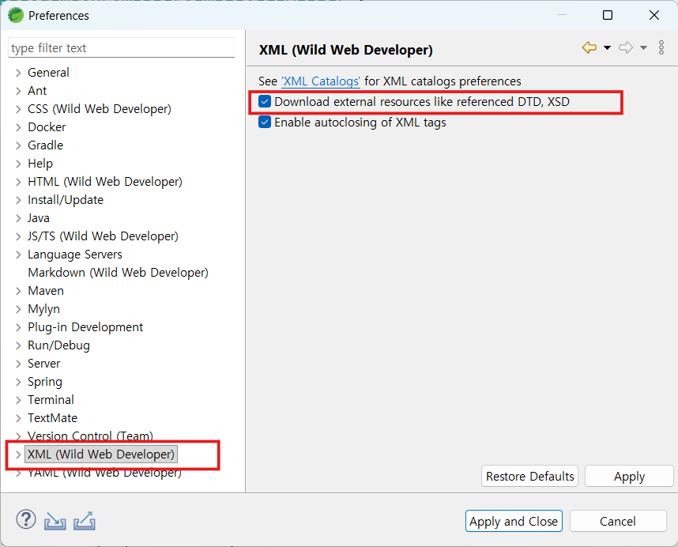

# Mybatis

### 라이브러리 의존성 추가

- mybatis-spring-boot-starter
- mybatis-spring-boot-starter-test : @MybatisTest 사용하려면 필요함

```xml
		<dependency>
			<groupId>com.oracle.database.jdbc</groupId>
			<artifactId>ojdbc11</artifactId>
			<scope>runtime</scope>
		</dependency>
		<dependency>
			<groupId>org.mybatis.spring.boot</groupId>
			<artifactId>mybatis-spring-boot-starter</artifactId>
			<version>3.0.5</version>
		</dependency>
		<dependency>
			<groupId>org.mybatis.spring.boot</groupId>
			<artifactId>mybatis-spring-boot-starter-test</artifactId>
			<version>3.0.5</version>
			<scope>test</scope>
		</dependency>
```

## 실습1. Mbatis 자바기반 설정, DAO 클래스

1. DataSource, [SqlSessionFactory](https://mybatis.org/spring/factorybean.html) 빈 등록(MyBatisConfig)
2. DTO 클래스 생성(EmployeeDTO)
3. mapper xml 작성(EmployeeMapper.xml)
4. DAO 클래스 생성(EmployeeDAO)
5. junit test(EmployeeDAOTest)

MyBatisConfig

```java
import javax.sql.DataSource;

import org.apache.ibatis.session.SqlSessionFactory;
import org.mybatis.spring.SqlSessionFactoryBean;
import org.springframework.context.annotation.Bean;
import org.springframework.context.annotation.ComponentScan;
import org.springframework.context.annotation.Configuration;
import org.springframework.core.io.support.PathMatchingResourcePatternResolver;

import com.zaxxer.hikari.HikariDataSource;

@Configuration
public class MyBatisConfig {

	// DataSource Bean 등록
	@Bean
	public DataSource dataSource() {
		HikariDataSource dataSource = new HikariDataSource();
		dataSource.setDriverClassName("oracle.jdbc.driver.OracleDriver");
		dataSource.setJdbcUrl("jdbc:oracle:thin:@localhost:1521/xe");
		dataSource.setUsername("hr");
		dataSource.setPassword("hr");
		return dataSource;
	}

	// SqlSessionFactory Bean 등록
	@Bean
	public SqlSessionFactory sqlSessionFactory(DataSource dataSource) throws Exception {

    SqlSessionFactoryBean factoryBean = new SqlSessionFactoryBean();
		factoryBean.setDataSource(dataSource);
		factoryBean.setMapperLocations(new PathMatchingResourcePatternResolver().getResources("classpath*:/mappers/**/*.xml"));

		org.apache.ibatis.session.Configuration configuration = new org.apache.ibatis.session.Configuration();
		configuration.setMapUnderscoreToCamelCase(true);
		factoryBean.setConfiguration(configuration);

		return factoryBean.getObject();
	}
}
```

EmployeesDTO

```java
import java.util.Date;
import org.apache.ibatis.type.Alias;
import lombok.Data;

@Data
@Alias("EmployeesDTO")
public class EmployeesDTO {
	private String employeeId;
	private String firstName;
	private String lastName;
	private String email;
	private String phoneNumber;
	private Date hireDate;
	private String jobId;
	private Long salary;
	private Double commissionPct;
	private String managerId;
	private String departmentId;
}
```

EmployeeMapper.xml

```xml
<?xml version="1.0" encoding="UTF-8"?>
<!DOCTYPE mapper PUBLIC "-//mybatis.org//DTD Mapper 3.0//EN" "http://mybatis.org/dtd/mybatis-3-mapper.dtd">
<mapper namespace="Employees">

	<!-- 단건조회 -->
	<select id="findById"
	        resultType="com.yedam.app.dao.EmployeesDTO"
	        parameterType="int">
		SELECT EMPLOYEE_ID,
			     FIRST_NAME,
		       LAST_NAME
		  FROM EMPLOYEES
		 WHERE EMLOYEE_ID = #{employeeId}
	</select>

</mapper>
```

EmployeesDAO

```java
import java.util.HashMap;
import java.util.List;
import java.util.Map;
import org.mybatis.spring.SqlSessionTemplate;
import org.springframework.stereotype.Repository;
import lombok.RequiredArgsConstructor;

@RequiredArgsConstructor
@Component
public class EmployeesDAO {

	private final SqlSessionTemplate sqlSession;

	public EmployeesDTO findById(Integer id) {
		return sqlSession.selectOne("Employees.findById", id);
	}
}

```

EmployeeDAOTest

```java
import static org.junit.Assert.assertEquals;
import org.junit.jupiter.api.Test;
import org.springframework.beans.factory.annotation.Autowired;
import org.springframework.boot.test.context.SpringBootTest;
import com.yedam.app.config.MyBatisConfig;
import com.yedam.app.dao.EmployeeDAO;
import com.yedam.app.dao.EmployeesDto;

@SpringBootTest(classes = {MyBatisConfig.class})
public class EmplpyeeDAOTest {

	@Autowired
	EmployeesDAO dao;

	@Test
	public void test() {
		//given
		Integer employeeId = 100;

		//when
		EmployeesDTO dto =  dao.findById(employeeId);
		System.out.println(dto);

		//then
		assertEquals(dto.getEmployeeId(), employeeId.toString());
	}
}
```

### 로그 지정

application.properties 파일에 로그레벨 지정

| 로그 내용  | 레벨  | 설명     |
| :--------- | :---- | :------- |
| Preparing  | DEBUG | sql구문  |
| Parameters | DEBUG | 파라미터 |
| Total      | DEBUG | 처리건수 |
| Columns    | TRACE | 조회컬럼 |
| Row        | TRACE | 조회결과 |

```yml
#mapper namespace 로그레벨지정
logging.level.Employees=debug
```

debug 레벨에서는 Preparing, Parameters, Total 이 보임

```
==>  Preparing: SELECT EMPLOYEE_ID, FIRST_NAME, LAST_NAME FROM employees WHERE employee_id = ?
==> Parameters: 100(Long)
<==      Total: 1
```

```yml
#mapper namespace 로그레벨지정
logging.level.Employees=trace
```

debug 레벨에서는 Preparing, Parameters, Total, columns, Row 이 보임

```
 ==>  Preparing: SELECT EMPLOYEE_ID, FIRST_NAME, LAST_NAME FROM employees WHERE employee_id = ?
 ==> Parameters: 100(Long)
 <==    Columns: EMPLOYEE_ID, FIRST_NAME, LAST_NAME
 <==        Row: 100, Steven, King
 <==      Total: 1
```

### 실습2. spring Boot 자동 설정과 mapper 인터페이스

1. application.properties 설정 : 자동으로 DataSource, SqlSessionFactory bean이 등록됨.
2. @MapperScan 어느테이션 지정(Ex02MybatisApplication)
3. EmployeeDTO
4. mapper xml 작성(EmployeeMapper.xml)
5. mapper 인터페이스 작성(EmployeeMapper)
6. mapper 인터페이스 테스트(EmployeeMapperTest)

application.properties

```yml
spring.application.name=ex02mybatis
server.port=81

#Oracle DataSource
spring.datasource.driver-class-name=oracle.jdbc.driver.OracleDriver
spring.datasource.url=jdbc:oracle:thin:@localhost:1521/xe
spring.datasource.username=hr
spring.datasource.password=hr

# mybatis 설정
mybatis.configuration.map-underscore-to-camel-case=true
mybatis.type-aliases-package=com.yedam.app
mybatis.mapper-locations=classpath:mappers/**/*.xml

# log 설정
logging.level.com.example.demo=debug
logging.pattern.console= %-5level %logger - [%L]%msg%n
```

ExMybatisApplication  
config 설정파일에 `@MapperScan(basePackages = "com.yedam.app.**.mapper")`을 추가하거나 mapper interface에 @Mapper를 추가

```java
@MapperScan(basePackages = "com.yedam.app.**.mapper")
@SpringBootApplication
public class ExMybatisApplication {

  public static void main(String[] args) {
    SpringApplication.run(ExMybatisApplication.class, args);
	}

}
```

EmployeesDTO

EmployeesMapper.xml  
namespace는 `인터페이스 패키지경로.인터페이스` 이름과 동일해야함.

```XML
<?xml version="1.0" encoding="UTF-8" ?>
<!DOCTYPE mapper PUBLIC "-//mybatis.org//DTD Mapper 3.0//EN"
  "http://mybatis.org/dtd/mybatis-3-mapper.dtd">

<mapper namespace="com.yedam.app.mapper.EmployeesMapper">
  ...
</mapper>
```

mapper xml 위치 지정

- properties에 mybatis.mapper-locations설정

  ```yml
  mybatis.mapper-locations=classpath:mappers/**/*.xml
  ```

- mapper 인터페이스와 mapper xml이 같은 패키지에 있으면 생략 가능함.
  ```
    mapper
      ├─ EmployeeMapper.xml
      └─ EmployeeMapper.java
  ```

EmployeesMapper

```java
@Mapper  //@MapperScan이 지정되어 있으면 생략가능
public interface EmployeesMapper {
	List<EmployeesDTO>  findAll();
	EmployeesDTO findById(Integer employeeId);
}
```

## Mapper Interface 와 XML 작성

### Mybatis 어노테이션

| 분류        | 어노테이션                                 |
| ----------- | ------------------------------------------ |
| Mapper 등록 | `@Mapper`, `@MapperScan`                   |
| CRUD        | `@Select`, `@Insert`, `@Update`, `@Delete` |
| 동적 SQL    | @SelectProvider, @UpdateProvider 등        |
| 매핑        | @Results, @Result, @ResultMap              |
| 생성자 매핑 | @ConstructorArgs, @Arg                     |
| 파라미터    | `@Param`                                   |
| 키 생성     | @Options, `@SelectKey`                     |
| 캐시        | @CacheNamespace, @CacheNamespaceRef        |
| 기타        | @Flush                                     |

### Mapper 인터페이스

```java
public interface EmployeesMapper {

  List<Map<String,Object>> findAllMap();
	List<EmployeesDTO> findAll();
	int SelectAllCount();

	List<EmployeesDTO> findAll(EmployeesSearchDTO search);
	List<EmployeesDTO> findAll(
			@Param("employee")EmployeesDTO dto,
			@Param("search") EmployeesSearchDTO search);

	List<EmployeesDTO> findBydeptAndName(
			@Param("departmentId") Long departmentId,
			@Param("firstName") String firstName);

	Optional<EmployeesDTO> findById(Integer employeeId);

	@Select("select * from employees where email = #{email}")
	Optional<EmployeesDTO> findById(String email);

	int insert(EmployeesDTO dto);
	int update(EmployeesDTO dto);
	int deleteById(Integer employeeId);
  int deleteByIds(String[] ids);
  int deleteByIds(EmployeesSearchDTO search);
	int deleteAll();

}
```

- SQL문을xml 파일에 작성하지 않고 어노테이션을 이용해서 직접 매핑 가능(@Select, @Delete, @Insert 등)
- 인수가 2개 이상이면 @Param 을 지정

### Mapper xml 작성

```XML
<?xml version="1.0" encoding="UTF-8" ?>
<!DOCTYPE mapper PUBLIC "-//mybatis.org//DTD Mapper 3.0//EN"
  "http://mybatis.org/dtd/mybatis-3-mapper.dtd">

<mapper namespace="com.example.demo.emp.mapper.EmpMapper">

<!-- 단건조회  -->
	<select id="getEmp" parameterType="EmpVO" resultType="EmpVO">
		SELECT  *
		FROM employees
		WHERE employee_id = #{employeeId}
	</select>

<!-- 전체조회  -->
	<select id="getEmpList" resultType="EmpVO">
		SELECT rownum id, e.*
		  FROM employees e
	</select>
</mapper>

```

### 테스트

```java
import java.util.Date;
import java.util.List;
import java.util.Map;

import org.junit.jupiter.api.Test;
import org.springframework.beans.factory.annotation.Autowired;
import org.springframework.boot.test.context.SpringBootTest;

import com.example.demo.emp.mapper.EmpMapper;

@SpringBootTest
public class EmpMapperTest {

	@Autowired EmpMapper mapper;

	//@Test
	public void 사원통계() {
		List<Map<String,Object>> list = mapper.getStat();
		for(Map<String,Object> map  : list ) {
			System.out.println(map.get("name") +":"+ map.get("cnt"));
		}
	}

	//@Test
	public void 사원삭제() {

	}

	@Test
	public void 사원등록() {
		//vo 객체 생성
		EmpVO vo = EmpVO.builder()
				 //  .employeeId(301)
				   .lastName("aaaa")
				   .email("a4@a.a")
				   .hireDate(new Date())
				   .jobId("IT_PROG")
				   .build();
		int result = mapper.insertEmp(vo);

		//등록된 사번을 조회
		System.out.println( "등록된 사번: " + vo.getEmployeeId() );
		System.out.println("등록건수=" + result);
	}

	//@Test
	public void 사원전체조회() {
		EmpVO vo = new EmpVO();
		SearchVO svo = new SearchVO();
		//vo.setDepartmentId("50");
		//vo.setFirstName("Kevin");
		//vo.setManagerId("103");
		//vo.setStart(1);
		//vo.setEnd(100);
		svo.setEmployeeIds(new int[]{100,101,102});
		List<EmpVO> list = mapper.getEmpList(vo, svo);
		//for employeeId, firstName 출력
		for(EmpVO emp : list) {
			System.out.println(emp.getEmployeeId() + ":"  + emp.getFirstName());
		}
		System.out.println("결과는="+list.size());
		//assertEquals(list);
	}

	//@Test
	public void 사원단건조회() {
		int employeeId = 100;
		EmpVO vo = mapper.getEmpInfo(employeeId);
		System.out.println(vo);
		//assert(employeeId, vo.getEmployeeId());
	}
}
```

#### DTD 에러

dtd 다운로드 허용  


## PageHelper

페이징 처리하기

#### 의존성 추가

scope를 compile로 지정해야 interceptor가 등록됨.  
maven

```xml
<!-- Source: https://mvnrepository.com/artifact/com.github.pagehelper/pagehelper-spring-boot-starter -->
<dependency>
    <groupId>com.github.pagehelper</groupId>
    <artifactId>pagehelper-spring-boot-starter</artifactId>
    <version>2.1.1</version>
    <scope>compile</scope>
</dependency>
```

gradle

```
implementation 'com.github.pagehelper:pagehelper-spring-boot-starter:2.1.1'
```

#### mapper xml, 인터페이스

목록조회 id 뒤에 "\_COUNT"를 붙여서 건수조회 쿼리 추가

```xml
   <!-- 전체조회 -->
	<select id="selectAll" resultType="EmpVO">
	SELECT *
      FROM employees
      ORDER BY employee_id
	</select>

	<!-- 전체건수 -->
	<select id="selectAll_COUNT" resultType="long">
	SELECT count(*)
	  FROM employees
	</select>
```

```java
public interface EmpMapper {
	// 전체조회
	public List<EmpVO> selectAll();
   // 전체건수
	public Long selectAll_COUNT();
}
```

#### service

서비스에서 매퍼 호출할 때 PageHelper를 적용해야 함.

```java
	public PageInfo<EmpVO> findAll(Integer pageNum) {
		// 사원전체조회
		PageInfo<EmpVO> page = PageHelper.startPage(pageNum, 3)
				                         .doSelectPageInfo(() -> empMapper.selectAll());

		log.info("TotalCount : {}, CurrentPage : {}, PageSize : {}, TotalPage : {}"
              ,page.getTotal()
              ,page.getPageNum()
              ,page.getPageSize()
              ,page.getPages());

		return page;
	}
```

```java
	    PageHelper.startPage(pageNum, 5);            // startPage 지정.
	    List<EmpVO> list = empMapper.selectAll();    // 다음에 실행되는 매퍼 쿼리에만 적용됨. (쿼리를 paging되게 수정하여 실행)
	    PageInfo<EmpVO> page = new PageInfo<>(list); // page 정보를 담음
```


PageHelper에 의해 수정된 쿼리

```sql
SELECT *
  FROM ( SELECT TMP_PAGE.*, ROWNUM PAGEHELPER_ROW_ID
           FROM ( SELECT *
                    FROM employees ORDER BY employee_id
                ) TMP_PAGE
       )
 WHERE PAGEHELPER_ROW_ID <= ? AND PAGEHELPER_ROW_ID > ?
```
