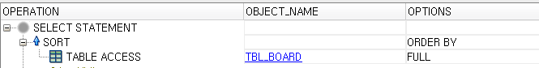
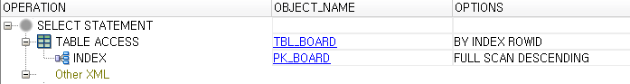
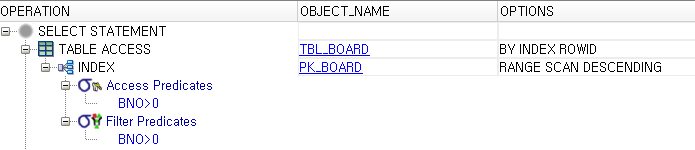
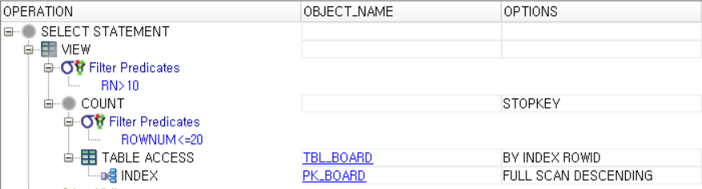

### 페이징 쿼리

백만건 데이터 입력

```SQL
-- 여러번 반복 실행
insert into tbl_board (bno, title, content, writer) select  seq_board.nextval, title, content, writer from tbl_board;
select count(*) from tbl_board;
```

order by -> full table scan

```SQL
SELECT * FROM tbl_board ORDER BY bno + 1 DESC;
```



index full scan

```SQL
SELECT * FROM tbl_board ORDER BY bno DESC;
```



index range scan

```SQL
select /*+index_desc(TBL_BOARD PK_BOARD)*/ * from tbl_board ;
```



```SQL
SELECT * FROM (
    SELECT ROWNUM RN, BNO, TITLE, WRITER
    FROM (
        select BNO, TITLE, WRITER FROM TBL_BOARD ORDER BY BNO DESC
    ) WHERE rownum <=20
) WHERE RN > 10;
```

```SQL
SELECT BNO, TITLE, WRITER FROM (
    select /*+index_desc(TBL_BOARD PK_BOARD)*/ ROWNUM RN, BNO, TITLE, WRITER
    from tbl_board WHERE ROWNUM <=20
) WHERE RN > 10;
```



### buffer_cache 비우기

한번 수행한 이후에는 해당 블록들을 Data Buffer Cache에 보관하고 있기때문에 정확한 시간 측정이 힘들다
이 경우에는 강제로 Data Buffer Cache를 비워준 이후에 측정하면 된다.

```SQL
 ALTER SYSTEM FLUSH BUFFER_CACHE;
```

쿼리의 파싱속도 자체도 영향을 미치는 조건이므로 Shared Pool 도 Flush 시켜줘야될 필요성이 있다

```SQL
ALTER SYSTEM FLUSH SHERED_POOL;
```

<PRE>
V$MYSTAT에 액세스를 실패했습니다.
데이터베이스 관리자로부터
카탈로그 읽기 권한을 얻으십시오.
grant SELECT_CATALOG_ROLE to HR
grant SELECT ANY DICTIONARY to HR
참고: 설정 변경사항을 적용하려면 현재
세션을 재접속해야 합니다.
</PRE>

```SQL
grant SELECT_CATALOG_ROLE to HR;
grant SELECT ANY DICTIONARY to HR;
```

### 페이징

totalRecord와 page만 지정되면 나머지 자동 계산됨

```JAVA
@Data
public class Paging {
	int pageUnit=10 ;  //한페이지 출력할 레코드 건수
	int pageSize=10 ;  //페이지번호 수 (5) 1~ 5까지
	int lastPage;      //마지막 페이지번호
	int totalRecord;  //전체 레코드건수
	Integer page = 1;	  //현재 페이지
	int startPage;  //페이지그룹내에서 시작페이지번호
	int endPage;  //페이지그룹내에서 마지막페이지번호
	int first;
	int last;

	public int getFirst() {
		first = (getPage() - 1) * getPageUnit() + 1;
		return first;
	}

	public int getLast() {
		last = getPage() * getPageUnit();
		return last;
	}

	public int getPageUnit() {
		return pageUnit;
	}

	public void setPageUnit(int pageUnit) {
		this.pageUnit = pageUnit;
	}

	public int getPageSize() {
		return pageSize;
	}

	public void setPageSize(int pageSize) {
		this.pageSize = pageSize;
	}

	public int getLastPage() {
		lastPage = totalRecord / pageUnit +
				   ( totalRecord % pageUnit>0 ? 1 : 0 );
		return lastPage;
	}

	public void setLastPage(int lastPage) {
		this.lastPage = lastPage;
	}

	public int getTotalRecord() {
		return totalRecord;
	}

	public void setTotalRecord(int totalRecord) {
		this.totalRecord = totalRecord;
	}

	public Integer getPage() {
		return page;
	}

	public void setPage(Integer page) {
		this.page = page;
	}

	public int getStartPage() {
		startPage = (page-1)/pageSize * pageSize + 1;
		return startPage;
	}

	public void setStartPage(int startPage) {
		this.startPage = startPage;
	}

	public int getEndPage() {
		endPage = (page-1)/pageSize  * pageSize  + pageSize ;
		if ( endPage > getLastPage() )
			endPage = getLastPage() ;
		return endPage;
	}

	public void setEndPage(int endPage) {
		this.endPage = endPage;
	}

}
```

BoardSearchDTO 검색에 필요한 값을 저장

```java
@Data
public class BoardSearchDTO {
	int start;
	int end;
}

```

매퍼 쿼리 수정

```xml
<!-- getList : 전체조회 -->
<select id="getList" resultType="BoardDTO">
	SELECT * FROM (
	    SELECT ROWNUM RN, BNO, TITLE, WRITER
	    FROM (
	        select BNO, TITLE, WRITER FROM TBL_BOARD ORDER BY BNO DESC
	  <![CDATA[
	    ) WHERE rownum <= #{end}
	  ]]>
	) WHERE RN > #{start}
</select>

<!-- 카운트 -->
<select id="getCount">
  SELECT COUNT(*) FROM TBL_BOARD
</select>
```

서비스 수정

서비스 테스트

컨트롤러 수정

```java
@GetMapping("/board/list")
	public void list(Model model, BoardSearchDTO searchDTO, Paging paging) {

		//페이징처리
    paging.setPage(2);
    paging.setPageUnit(5);
    paging.setPageSize(3);
		paging.setTotalRecord(service.getCount(vo));
		model.addAttribute("paging", paging);

		//목록 조회
		searchDTO.setStart(paging.getFirst());
		searchDTO.setEnd(paging.getLast());
		model.addAttribute("list", service.getList(searchDTO));

	}
```

컨트롤러 테스트

```java
@Slf4j
@AutoConfigureMockMvc
@SpringBootTest
public class BoardControllerTest {

    @Autowired MockMvc mvc;

    @Test
    @DisplayName("조회 컨트롤러")
    void list() throws Exception {
    	ModelMap map = mvc.perform(MockMvcRequestBuilders.get("/board/list"))
    	   .andReturn()
    	   .getModelAndView()
    	   .getModelMap();

    	log.debug(map.getAttribute("list").toString());
    	log.debug(map.getAttribute("paging").toString());

    }
```

페이지 번호 출력

```HTML
  <!-- 페이징 시작 -->
	<nav aria-label="...">
	  <ul class="pagination">
	    <li class="page-item" th:classappend="${paging.startPage} == 1 ? disabled">
	        <a class="page-link" th:href="|javascript:gopage(${paging.startPage})|">Previous</a></li>

	    <li th:each="num : *{#numbers.sequence(paging.startPage, paging.endPage)}"
	        class="page-item"
	        th:addclass="${num} == ${paging.page} ? active">
	        <a class="page-link" th:href="|javascript:gopage(${num})|"  th:text="${num}">2</a></li>

	    <li class="page-item" th:classappend="${paging.endPage} <= ${paging.lastPage} ? disabled">
	        <a class="page-link" th:href="|javascript:gopage(${paging.endPage})|">Next</a></li>
	  </ul>
	</nav>
	<!-- 페이징 종료 -->
```
