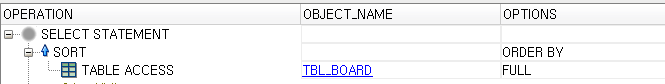
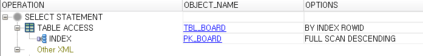
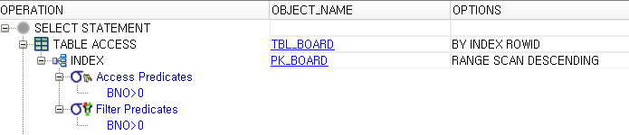
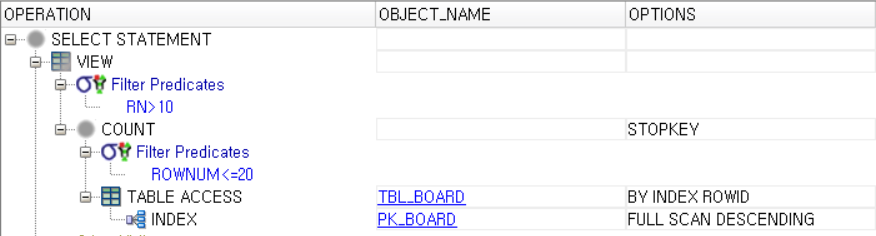
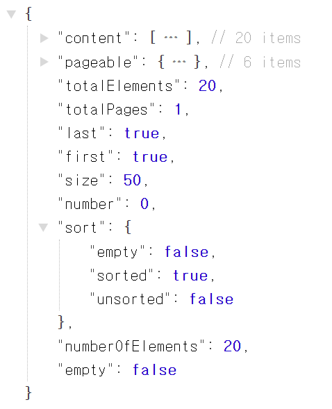

## 페이징과 검색

### 실행계획

백만건 데이터 입력

```SQL
-- 여러번 반복 실행
insert into tbl_board (bno, title, content, writer) select  seq_board.nextval, title, content, writer from tbl_board;
select count(*) from tbl_board;
```

#### full table scan

```SQL
SELECT * FROM tbl_board ORDER BY bno + 1 DESC;
```



#### index full scan

```SQL
SELECT * FROM tbl_board ORDER BY bno DESC;
```



#### index range scan

```SQL
select /*+index_desc(TBL_BOARD PK_BOARD)*/ * from tbl_board ;
```



### 페이징쿼리

#### 11g

```SQL
SELECT * FROM (
    SELECT ROWNUM RN, BNO, TITLE, WRITER
    FROM (
        select BNO, TITLE, WRITER FROM TBL_BOARD ORDER BY BNO DESC
    ) WHERE rownum <=20
) WHERE RN > 10;
```



```SQL
SELECT BNO, TITLE, WRITER FROM (
    select /*+index_desc(TBL_BOARD PK_BOARD)*/ ROWNUM RN, BNO, TITLE, WRITER
    from tbl_board WHERE ROWNUM <=20
) WHERE RN > 10;
```

#### 21c

```sql
select * from employees
offset 0 rows
fetch next 5 rows only;
```

### 페이징 조회(spring-data)

1. 의존성 설정
   JPA을 사용 중이라면 기본적으로 포함되어 있으나, 단독 사용 시에는 아래 의존성이 필요합니다.

```xml
<dependency>
    <groupId>org.springframework.data</groupId>
    <artifactId>spring-data-commons</artifactId>
</dependency>
```

2. springData 활성화

```java
@EnableSpringDataWebSupport
@SpringBootApplication
public class Ex02Application {
	public static void main(String[] args) {
		SpringApplication.run(Ex02Application.class, args);
	}
}
```

4. 컨트롤러에서 결과 반환 (PageImpl 활용)  
   조회된 리스트와 전체 개수를 PageImpl 객체에 담아 반환하면, JPA와 동일한 페이징 응답 규격을 유지할 수 있습니다.  
   @EnableSpringDataWebSupport가 활성화되어 있다면, 쿼리 파라미터(?page=0&size=10)가 Pageable 객체로 자동 변환됩니다.

```java
	@GetMapping("/api/empList")
	public PageImpl empPage( @PageableDefault(size = 50,
	         sort = "employee_id",
					 direction = Sort.Direction.DESC) Pageable pageable) {
		System.out.println(pageable);
		pageable.getSort().forEach(order -> {
			System.out.println("정렬 필드: " + order.getProperty()); // first_name, department_id 출력됨
			System.out.println("정렬 방향: " + order.getDirection()); // DESC, ASC 출력됨
		});

		List<EmpVO> content = empMapper.findAllPageAndSort(null,pageable);
		int total = empMapper.findAll_COUNT();
		return new PageImpl<>(content, pageable, total);
	}
```

```
http://localhost:8080/api/empPage?sort=first_name,desc&page=1&size=5

  sort : 정렬할 컬럼명과 순서
  page : 페이지번호
  size : 한페이지에 출력될 레코드 건수
```



5. MyBatis 매퍼(Mapper) 적용

Mapper Interface

```java
public List<EmpVO> findAllPageAndSort(@Param("emp") EmpVO vo, @Param("pageable") Pageable pagable);
long count();
```

XML Mapper

11g

```xml
	<select id="findAllPageAndSort">
    SELECT * FROM (
        SELECT a.*, ROWNUM rnum FROM (
            SELECT * FROM employees
            <if test="pageable.sort.sorted">
                ORDER BY
                <foreach collection="pageable.sort" item="order" separator=",">
                    ${order.property} ${order.direction}
                </foreach>
            </if>
        ) a
        WHERE ROWNUM &lt;= #{pageable.offset} + #{pageable.pageSize}
    )
    WHERE rnum &gt; #{pageable.offset}
	</select>
<!-- 카운트 -->
<select id="count" resultType="int">
  SELECT COUNT(*) FROM employees
</select>
```

21c

Pageable의 offset과 pageSize 값을 사용하여 SQL의 LIMIT 절에 매핑합니다.

```xml
<select id="selectUserList" resultType="UserVO">
    SELECT * FROM users
    ORDER BY id DESC
    LIMIT #{pageable.pageSize} OFFSET #{pageable.offset}
</select>
```

6. 페이지 번호 출력  
   fragments/paging.html

```HTML
  <!-- 페이징 시작 -->
  <nav div th:fragment="paging(item)">
    <ul class="pagination">
      <li class="page-item"
        th:classappend="${item.first} == 1 ? disabled"><a
        class="page-link"
        th:href="${items.first} ? '#' : @{/items(page=${items.number - 1})}">Previous</a></li>

      <li
        th:each="num : *{#numbers.sequence(0, items.totalPages - 1)}"
        class="page-item" th:classappend="${num} == ${item.number} ? active">
        <a class="page-link" th:href="|javascript:gopage(${num})|"
        th:text="${num}">2</a>
      </li>

      <li class="page-item"
        th:classappend="${items.last} ? 'disabled'">
        <a class="page-link"
        th:href="${items.last} ? '#' : @{/items(page=${items.number + 1})}">Next</a>
      </li>
    </ul>
  </nav>
  <!-- 페이징 끝 -->
```

```html
<div th:insert="~{fragments/paging :: paging(${pageVO})}"></div>
```

검색기능

```html
<!-- 검색폼 시작 -->
<div class="row">
  <div class="col-lg-12">
    <form id="searchForm" action="/board/list" method="get">
      <select name="type">
        <option value="">--</option>
        <option value="T">제목</option>
        <option value="C">내용</option>
        <option value="W">작성자</option>
        <option value="TC">제목 or 내용</option>
        <option value="TW">제목 or 작성자</option>
        <option value="TWC">제목 or 내용 or 작성자</option>
      </select>
      <input type="text" name="keyword" />
      <input type="hidden" name="page" value="1" />
      <select name="pageunit">
        <option value="10">10</option>
        <option value="20">20</option>
        <option value="30">30</option>
      </select>
      <button class="btn btn-success">Search</button>
    </form>
  </div>
</div>
<!-- 검색폼 끝 -->
```

### 페이징 조회(pagehelper)

#### dependency
```xml
<dependency>
    <groupId>com.github.pagehelper</groupId>
    <artifactId>pagehelper-spring-boot-starter</artifactId>
    <version>2.0.1</version>
</dependency>
```
#### mapper count 쿼리
```xml
<select id="selectAll_COUNT" resultType="int">
  SELECT COUNT(*) FROM employees
</select>
```
#### page
```java
PageInfo<User> page = PageHelper.startPage(pageNum, pageSize)
                                .doSelectPageInfo(() -> userMapper.selectUser());

log.info("TotalCount : {}, CurrentPage : {}, PageSize : {}, TotalPage : {}", page.getTotal()
                                                                           , page.getPageNum()
                                                                           , page.getPageSize()
                                                                           , page.getPages());

List<User> userList = page.getList();
```

### buffer_cache 비우기

한번 수행한 이후에는 해당 블록들을 Data Buffer Cache에 보관하고 있기때문에 정확한 시간 측정이 힘들다
이 경우에는 강제로 Data Buffer Cache를 비워준 이후에 측정하면 된다.

```SQL
 ALTER SYSTEM FLUSH BUFFER_CACHE;
```

쿼리의 파싱속도 자체도 영향을 미치는 조건이므로 Shared Pool 도 Flush 시켜줘야될 필요성이 있다

```SQL
ALTER SYSTEM FLUSH SHERED_POOL;
```

<PRE>
V$MYSTAT에 액세스를 실패했습니다.
데이터베이스 관리자로부터 카탈로그 읽기 권한을 얻으십시오.
grant SELECT_CATALOG_ROLE to HR
grant SELECT ANY DICTIONARY to HR
참고: 설정 변경사항을 적용하려면 현재 세션을 재접속해야 합니다.
</PRE>

```SQL
grant SELECT_CATALOG_ROLE to HR;
grant SELECT ANY DICTIONARY to HR;
```
