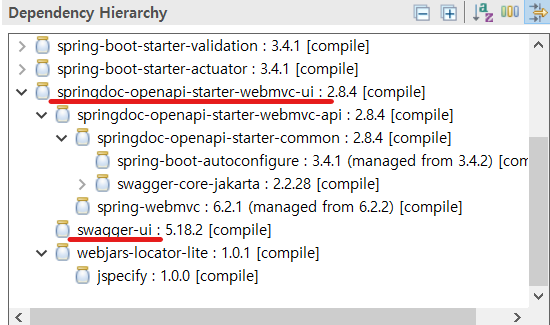
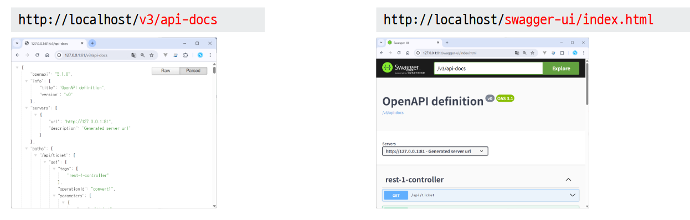
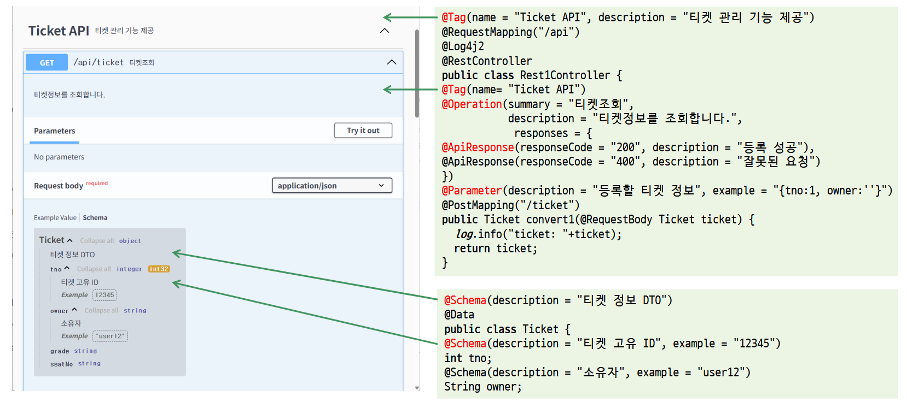

### REST 관련 애노테이션

| 애너테이션      | 기능                                               |
| :-------------- | :------------------------------------------------- |
| @RestController | Controller가 REST 방식을 처리하기 위한 것임을 명시 |
| @ResponseBody   | 데이터 자체를 전달                                 |
| @PathVariable   | URL 경로에 있는 값을 파라미터로 추출               |
| @CrossOrigin    | Ajax의 크로스 도메인 문제를 해결                   |
| @RequestBody    | JSON 데이터를 원하는 타입으로 바인딩               |
|                 |                                                    |

### Jackson-databind 라이브러리

- (JSON)Jackson-databind : https://github.com/FasterXML/jackson-databind
- (XML) jackson-dataformat-xml : https://github.com/FasterXML/jackson-dataformat-xml

### @RestController

- 문자열
- JSON
- XML

### 관련 기능

- REST
- MSA
- JWT
- SPA
- Spring APIDoc, SWAGGER : REST API Documentation을 위해 사용 
- HATEOAS : 응답에 데이터뿐만 아니라 해당 데이터와 관련된 요청에 필요한 URI를 응답에 포함하여 반환
- Spring REST Docs

## springdoc-openapi(swagger3)
Swagger : REST API Documentation을 위해 사용  


### reference
- https://springdoc.org/  
- https://swagger.io/solutions/api-design/
- https://mageddo.com/tools/yaml-converter  
- https://adjh54.tistory.com/561  
- https://sjh9708.tistory.com/169  

### dependency 추가

gradle  
```yaml
dependencies {
  #swagger
	implementation 'org.springdoc:springdoc-openapi-starter-webmvc-ui:2.8.15'
}
```

maven  
```xml
	    <dependency>
	        <groupId>org.springdoc</groupId>
	        <artifactId>springdoc-openapi-starter-webmvc-ui</artifactId>
	        <version>2.8.15</version>
	    </dependency>
```
       

### 어노테이션

```java
@Tag(name = "회원관리 API", description = "게임사이트 회원 가입")
@RequestMapping("/api")
@RestController //@Controller + @ResponseBody
public class Ex2Controller {

	@Tag(name = "회원관리 API")
	@Operation(summary = "회원조회")
	//UserVO 단건조회
	@GetMapping("/rest1")
	public UserVO rest1() {
		return new UserVO("홍길동", 20, new Date(),
									Arrays.asList("게임","등산"));
	}
```

     
    
     


| 애노테이션   | 설명                    | 예시                                                                         |
| :----------- | :---------------------- | :--------------------------------------------------------------------------- |
| @Tag         | API 그룹 설정           | @Tag(name = "posts", description = "게시물 API")                             |
| @Schema      | DTO의 필드를 문서화     | @Schema(description = "회원 ID", example = "1")                              |
| @Operation   | API의 메소드 단위 설명  | @Operation(summary = "회원 조회")                                            |
| @Parameter   | 메서드 파라미터 설명    | @Parameter(description = "회원 정보", example = "{mno:1, owner:''}")         |
| @ApiResponse | 응답 코드와 설명을 지정 | @Operation(summary = "회원 등록", description = "새로운 회원을 등록합니다.",responses = {     |
|              |                         | @ApiResponse(responseCode = "200", description = "등록 성공"),               |
|              |                         | @ApiResponse(responseCode = "500", description = "서버 에러")    }  )              |


### Swagger API 스펙 작성
```java

@Tag(name = "Ticket API", description = "티켓 관리 기능 제공")
@RequestMapping("/api")
@Log4j2
@RestController
public class Rest1Controller {

	@Tag(name= "Ticket API")
	@Operation(summary = "티켓조회", description = "티켓정보를 조회합니다.",
             responses = {
              @ApiResponse(responseCode = "200", description = "등록 성공"),
              @ApiResponse(responseCode = "400", description = "잘못된 요청")
        })
	@GetMapping("/ticket")
	public Ticket convert1(@RequestBody Ticket ticket) {

		log.info("ticket: "+ticket);
		return ticket;

	}

	@PostMapping("/ticket")
	public Ticket convert(@RequestBody Ticket ticket) {

		log.info("ticket: "+ticket);
		return ticket;

	}

	@PostMapping("/reserve")
	public Reserve comp(@RequestBody Reserve reserve) {

		log.info("owner: " + reserve.getList().get(0).getOwner());
		return reserve;
	}


	@PostMapping("/compMap")
	public JsonNode compMap(@RequestBody JsonNode node) {

		//첫번째 티켓의 owner 출력
		log.info("owner:" + node.get("list").get(0).get("owner").asText() );
		return node;
	}

}
```

### Swagger DTO 스펙 작성
```java
@Schema(description = "티켓 정보 DTO")
@Data
public class Ticket {

	@Schema(description = "티켓 고유 ID", example = "12345")
	int tno;

	@Schema(description = "소유자", example = "user12")
	String owner;

	String grade;

	String seatNo;
}

```

### 브라우저 확인
```
http://localhost:81/v3/api-docs
http://localhost:81/swagger-ui/index.html
```

```
# /api-docs endpoint custom path
springdoc.api-docs.path=/api-docs
springdoc.swagger-ui.path=/swagger-ui.html
```


## [HATEAOS](https://docs.spring.io/spring-boot/3.5/reference/web/spring-hateoas.html)
HATEOAS (Hypermidia As The Engine Of Application State)는 Hypermedia(링크)를 통해서 다음 가능한 행동(action)에 대한 정보를 응답 본문에 넣어주어야 한다.  추가정보를 제공  

HATEOAS(일명 헤이티오스)는 API를 실제로 "RESTful"하게 만드는 REST Appilcation Architecture의 제약 조건이다.기본적으로 요청에 대해 서버는 응답에 데이터만 클라이언트에게 보내는데,HATEOAS를 사용하면 응답에 데이터뿐만 아니라 해당 데이터와 관련된 요청에 필요한 URI를 응답에 포함하여 반환하며, 이는 REST API를 사용하는 클라이언트가 전적으로 서버와 동적인 상호작용이 가능하도록 해준다.

### [REST API 성숙도 모델](https://g4daclom.tistory.com/163)
  - Level 0: 단 하나의 endpoint를 사용하고, 전달되는 서로 다른 매개변수를 통해 하나의 endpoint에서 여러 동작을 하게 된다
  - Level 1: 리소스별로 고유한 URI를 사용  
  - Level 2: HTTP 메소드 원칙 준수. URI에는 행위(Action)가 포함되지 않고 HTTP Method로 표현한다.   
  - Level 3: HATEOAS 원칙 준수. Hypermedia(링크)를 통해서 다음 가능한 행동(action)에 대한 정보를 응답 본문에 넣어주어야 한다.  
  - Level 4


### 1. add dependency 

```xml
<!-- https://mvnrepository.com/artifact/org.springframework.boot/spring-boot-starter-hateoas -->
<dependency>
    <groupId>org.springframework.boot</groupId>
    <artifactId>spring-boot-starter-hateoas</artifactId>
    <version>3.4.3</version>
</dependency>
```

### 2. Controller에 HATEAOS 관련 코드 추가


### Swagger와 HATEOAS 비교

| 측면 | Swagger | HATEOAS |
| :-- | :-- |:----- |
| API 문서화 | Swagger는 소비자가 사용 가능한 엔드포인트, 요청 매개변수 및 응답을 사전에 이해할 수 있도록 UI를 갖춘 자세하고 인간이 읽을 수 있는 API 문서를 제공합니다. | HATEOAS는 서버에서 응답 내에 반환된 하이퍼미디어 링크에 의존하므로 문서화가 더 암묵적입니다. 따라서 소비자는 생성을 통해 이러한 링크를 통해 동적으로 작업을 발견합니다. |
| 클라이언트 측 구현 | 클라이언트는 일반적으로 Swagger 사양을 기반으로 생성되거나 작성됩니다. API의 구조는 사전에 알려져 있으며, 클라이언트는 미리 정의된 경로에 따라 요청을 할 수 있습니다. | HATEOAS 클라이언트는 응답 내의 하이퍼미디어 링크를 통해 사용 가능한 작업을 발견하여 API와 동적으로 상호작용합니다. 클라이언트는 전체 API 구조를 사전에 알 필요가 없습니다. |
| 유연성 | Swagger는 미리 정의된 엔드포인트와 일관된 API 구조를 기대하고 있어 보다 경직되어 있습니다. 이는 문서 또는 사양을 업데이트하지 않고 API를 발전시키기 어렵게 만듭니다. | HATEOAS는 API가 발전할 수 있도록 더 큰 유연성을 제공하여 하이퍼미디어 기반 응답을 변경하더라도 기존 클라이언트에 영향을 주지 않습니다. |
| 소비자 용이성 | 자동 생성된 문서 또는 API 사양에서 직접 클라이언트 코드를 생성하는 도구에 의존하는 소비자에게는 쉽습니다. | 소비자에게는 더 복잡합니다. 이들은 응답을 해석하고 하이퍼미디어 링크를 따라 개별적으로 작업을 발견해야 합니다. |
| API 발전 | API 구조의 모든 변경은 Swagger 사양을 업데이트하고, 클라이언트 코드를 재생성하며, 사용자가 사용하도록 배포해야 합니다. | HATEOAS는 클라이언트가 하이퍼미디어를 통해 API를 탐색하므로 API가 발전할 때 업데이트가 덜 필요합니다. |
| 버전 관리 | Swagger는 일반적으로 명시적인 버전 관리와 함께 여러 버전의 API를 별도로 유지 관리해야 합니다. | HATEOAS는 클라이언트가 제공된 링크를 따라 동적으로 발전하므로 엄격한 버전 관리 없이 진화할 수 있습니다. |
||||

HATEOAS는 응답에 포함된 하이퍼미디어 링크를 통해 클라이언트를 API 상호작용으로 동적으로 안내하는 데 중점을 두며, Swagger (또는 OpenAPI)는 API의 구조, 엔드포인트 및 작업을 설명하는 정적이고 인간이 읽을 수 있으며 기계가 읽을 수 있는 API 문서를 제공합니다

### spring OpenAPI Doc 과 spring REST Docs
- Swagger (OpenAPI) → 코드(어노테이션) 기반 자동 문서 생성. 자동으로 그린 설계도
- Spring REST Docs → 테스트 기반 문서 생성. 실제 시공 후 검증된 설계도
  
|항목|Swagger|REST Docs|
|:-|:-|:-|  
|생성방식|코드 어노트에션|테스트기반|
|UI제공|있음|없음|
|사용처|스타트업|공공SI, 금융|