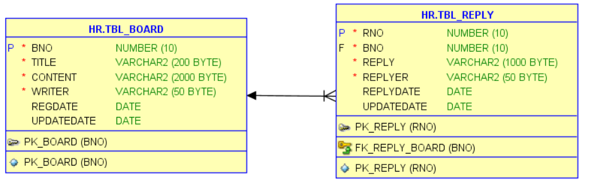
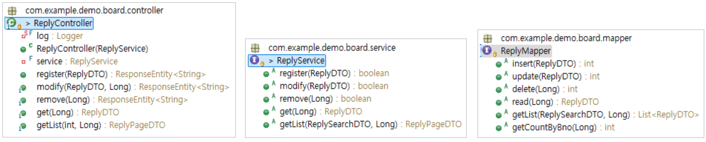

## 댓글 구현

### 작업순서

1. `테이블 생성`과 더미 데이터 생성
2. `DTO` 선언
3. `Mapper` 인터페이스, `Mapper XML`
4. `Service` 인터페이스, `ServiceImpl` 구현 클래스
5. `Controller` 클래스
6. 뷰페이지 Javascript `ajax`

## 1. 테이블 생성

```sql
create table tbl_reply (
  rno number(10,0),
  bno number(10,0) not null,
  reply varchar2(1000) not null,
  replyer varchar2(50) not null,
  replyDate date default sysdate,
  updateDate date default sysdate
);

create sequence seq_reply;

alter table tbl_reply add constraint pk_reply primary key (rno);

alter table tbl_reply  add constraint fk_reply_board
foreign key (bno)  references  tbl_board (bno);

insert into tbl_reply (rno, bno, reply, replyer)  values ( seq_reply.nextval, 1, '댓글1', '홍길동' );
```



## 패키지 구성



<pre>
com.example.demo.board.controller     - ReplyController
                      .mapper         - ReplyMapper 
                      .service        - ReplyService, ReplyDTO, ReplyPageDTO
                      .service.impl   - ReplyServiceImpl  
src/main/resources/mappers            - ReplyMapper.xml                                      
</pre>

ReplyDTO

```java
rno
bno
reply
replyer
replydate
updatedate
```

ReplyPageDTO

```java
@Data
@AllArgsConstructor
public class ReplySearchDTO {

	int page;
	int amount;

	public int getStart() {
		return (page-1)*amount +1;
	}

	public int getEnd() {
		return page*amount;
	}
}
```

ReplyMapper xml

```xml

```

ReplyMapper

```java

```

ReplyService

```java

```

ReplyServiceImpl

```java

```

ReplyServiceTest


```java
@Slf4j
@SpringBootTest
public class ReplyServiceTest {

	@Autowired
	ReplyService replyService;

	@Test
	@DisplayName("댓글 수정")
	public void update() {
		// given
		ReplyDTO reply = ReplyDTO.builder()
				   .rno(2L)          // 실행전 존재하는 번호인지 확인할 것
				   .reply("댓글수정")
				   .replyer("김수정")
				   .build();

		// when
		boolean result = replyService.modify(reply);

		// then
		assertThat(result).isEqualTo(true);
	}

}

```

ReplyController 설계

| 작업   | URL                      | HTTP 전송방식 |
| :----- | :----------------------- | :------------ |
| 등록   | /replys/new              | POST          |
| 조회   | /replys/:rno             | GET           |
| 삭제   | /replys/:rno             | DELETE        |
| 수정   | /replys/:rno             | PUT or PATCH  |
| 페이지 | /replys/pages/:bno/:page | GET           |
|        |                          |               |

ReplyControllerTest

```java

import static org.springframework.test.web.servlet.request.MockMvcRequestBuilders.get;
import static org.springframework.test.web.servlet.result.MockMvcResultHandlers.print;
import static org.springframework.test.web.servlet.result.MockMvcResultMatchers.jsonPath;
import static org.springframework.test.web.servlet.result.MockMvcResultMatchers.status;

import org.junit.jupiter.api.DisplayName;
import org.junit.jupiter.api.Test;
import org.springframework.beans.factory.annotation.Autowired;
import org.springframework.boot.test.autoconfigure.web.servlet.AutoConfigureMockMvc;
import org.springframework.boot.test.context.SpringBootTest;
import org.springframework.http.MediaType;
import org.springframework.test.web.servlet.MockMvc;

@Slf4j
@AutoConfigureMockMvc
@SpringBootTest
public class ReplyControllerTest {

    @Autowired MockMvc mvc;

    @Autowired ObjectMapper objectMapper;

    //@Test
    @DisplayName("reply 등록")
    void register() throws Exception {
    	//given
    	String requestBody = """
    			{
    			  "bno": 1,
    			  "reply": "댓글등록",
    			  "replyer": "이순신"
    			}
    			""";

    	//when //then
    	mvc.perform(post("/replies/new")
    	    	     .content(requestBody)
    	    	     .contentType(MediaType.APPLICATION_JSON_VALUE)
    	)
    	.andExpect(status().isOk())
        .andDo(MockMvcResultHandlers.print());

    }

        //@Test
    @DisplayName("reply 단건 조회")
    void getreply() throws Exception {

    	//given
    	Long rno = 2L;
    	String url = "/replies/"+ rno;

    	//when
    	mvc.perform(
    			get(url).
    			accept(MediaType.APPLICATION_JSON_VALUE)
    	)
    	//then
    	.andExpect(status().isOk())
    	.andExpect(jsonPath("$.reply").value("댓글수정"))
       .andDo(print())  ;

    }

    @Test
    @DisplayName("게시글의 reply 조회")
    void getreplyByBno() throws Exception {

    	//given
    	Long bno = 1L;
    	int page = 1;
    	//String url = String.format("/replies/pages/%d/%d", bno, page);

    	//when
    	String responseBody = mvc.perform(
    			get("/replies/pages/{bno}/{page}",bno, page)
    			.accept(MediaType.APPLICATION_JSON_VALUE)
    	)
    	.andReturn().getResponse().getContentAsString();

    	//then
    	String json = objectMapper.readTree(responseBody).toPrettyString();
    	log.debug(json);

    	ReplyPageDTO dto = objectMapper.readValue(responseBody, ReplyPageDTO.class);

    	log.debug("replyCnt : " + dto.getReplyCnt() );
    	log.debug("first reply : " + dto.getList().get(0).getReply() );
    }
```

MocMvc 요청 메서드

| 메서드      | 용도                                            | 예시                                    |
| :---------- | :---------------------------------------------- | :-------------------------------------- |
| get         | GET 메서드. pathvariable은 두번째 인수부터 지정 | get("/replyies/{rno}","1")              |
| post        | POST 메서드                                     | post("/replyies/new")                   |
| put         | PUT 메서드                                      | delete("/replyies/{rno}","1")           |
| delete      | DELETE 메서드                                   | put("/replyies/{rno}","1")              |
| contentType | 요청 헤더의 Content-Type을 지정                 | ContentType(MediaType.APPLICATION_JSON) |
| header      | 임의의 요청 헤더를 지정                         | header("CUSTOMER_HEADER","foo")         |
| content     | 요청 바디를 지정                                | content("{\"reply\":\"홍길동\"}")       |

MocMvc 응답 메서드

| 메서드   | 용도                        | 예시                                                         |
| :------- | :-------------------------- | :----------------------------------------------------------- |
| status   | 상태코드 확인               | status().isNoContent()                                       |
| header   | 응답헤더의 값을 확인        | header().string("Location", "http://localhost:81/replies/1") |
| content  | 응답바디의 내용을 확인      | content().json("{}")                                         |
| jspnPath | 응답바디의 json 내용를 확인 | jsonPath("$.reply").value("댓글")                            |
| xpath    | 응답바디의 xml 내용을 확인  | xpath("/replies/reply").string("댓글")                       |
|          |                             |                                                              |


### 뷰페이지
```html
<!DOCTYPE html>
<html xmlns:th="http://www.thymeleaf.org">
<head>
<meta charset="UTF-8">
<link
	href="https://cdn.jsdelivr.net/npm/bootstrap@5.3.3/dist/css/bootstrap.min.css"
	rel="stylesheet"
	integrity="sha384-QWTKZyjpPEjISv5WaRU9OFeRpok6YctnYmDr5pNlyT2bRjXh0JMhjY6hW+ALEwIH"
	crossorigin="anonymous">
<title>Insert title here</title>
<script th:inline="javascript">

/*            버튼 클래스명          이벤트핸들러(함수)       ajax 콜백함수 
	댓글리스트                       replyList         replyListCallback
	
	삭제       btnReplyDelete      replyDelete,       replyDeleteCallback
	수정폼     btnReplyUpdateForm   replyUpdateForm,    
	
	수정       btnReplyUpdate      replyUpdate,       replyUpdateCallback
	취소       btnReplyCancel      replyCancel
	
	등록       btnReplyInsert      replyInsert,        replyInsertCallback
*/

/*-------------------------------------
전역 변수
---------------------------------------*/
const bno = [[${board.bno}]]  //게시글번호


/*-------------------------------------
페이지 로드 이벤트
버튼 이벤트 등록 및 리스트 조회
---------------------------------------*/
window.addEventListener("DOMContentLoaded", function(){
	replyList();       //댓글조회
	replyDelete();     //삭제 버튼 이벤트 지정
	replyUpdateForm(); //수정폼 버튼 이벤트 지정
	replyUpdate();     //수정 버튼 이벤트 지정
	replyCancel();     //취소 버튼 이벤트 지정
	replyInsert();     //등록 버튼 이벤트 지정
	
});	


/*-------------------------------------
댓글 조회 ajax 호출
---------------------------------------*/
function replyList(){
	const url = `/replies/pages/${bno}/1`
	fetch( url )
	.then( result => result.json() )
	.then( result => replyListCallback(result) )
}


/*-------------------------------------
댓글 조회 콜백
---------------------------------------*/
function replyListCallback(result){
	const replys = document.querySelector(".replys");
	replys.innerHTML = "";
	result.list.forEach(item => replys.insertAdjacentElement("beforeend", replyMake(item)) );
}

/*-------------------------------------
페이지 번호 태그 만들기
---------------------------------------*/
function pagingMake(paging){
	
	let tag = `<ul class="pagination">`;
	
	//이전버튼
	if (paging.startPage > 1) {
		tag += `<li class="page-item">
		          <a class="page-link" 
		             href="javascript:gopage(${paging.startPage-1})">이전</a>
		        </li>`
	}
	
	//페이지 번호
	for(let i = paging.startPage; i<=paging.endPage; i++ ) {
		tag+=`<li class="page-item">
	            <a class="page-link" 
	              href="javascript:gopage(${i})">${i}</a>
	          </li>`
	}
	
	//다음 버튼
	if (paging.endPage < paging.lastPage ) {
	tag += `<li class="page-item">
	          <a class="page-link" 
	             href="javascript:gopage(${paging.endPage +1})">다음</a>
	        </li>`
	}
	tag += `</ul>`
	
	return tag;
}

/*-------------------------------------
댓글 조회 태그 생성
---------------------------------------*/
function replyMake(item){
	let tag = document.createElement("div");
	tag.className = "row mt-2";
	tag.innerHTML = `
        <div class="col-6">${item.reply}</div>
        <div class="col-3">${item.replyer}</div>
        <div class="col-3">
          <button type="button"
                  data-rno="${item.rno}" 
                  class="btn btn-success btnReplyUpdateForm">수정</button>			                           
          <button type="button"
                  data-rno="${item.rno}" 
                  class="btn btn-danger btnReplyDelete">삭제</button>
        </div>`;
    return tag;    
}

/*-------------------------------------
댓글 삭제 ajax 호출
---------------------------------------*/
function replyDelete(){
	document.querySelector(".replys").addEventListener("click", function(){
		//삭제버튼이면
		if(event.target.classList.contains("btnReplyDelete")) {
			if(! confirm("삭제할까요")){
				return;
			}
			// 버튼을 포함하는 부모태그
			const div = event.target.closest(".row");
			// 삭제할 댓글번호 
			const rno = event.target.dataset.rno;
			// 서버 삭제 요청
			const url = `/replies/${rno}`;
			fetch(url, {method:"delete"})
			.then(result => result.text())
			.then(result => div.remove() )
		}
	})
}
	
	
/*-------------------------------------
수정폼 버튼 이벤트 지정
---------------------------------------*/	
function replyUpdateForm(){

	document.querySelector(".replys").addEventListener("click", function(){
		//수정 폼 버튼이면
		if(event.target.classList.contains("btnReplyUpdateForm")) {
			// 버튼을 포함하는 부모태그
			const div = event.target.closest(".row");
			
			// 수정할 데이터 
			const rno = event.target.dataset.rno;
			const reply = div.children[0].innerHTML;
			const replyer = div.children[1].innerHTML;
		
			const item = {rno, reply, replyer};
			
			// 수정폼으로 변경
			div.replaceWith( replyFormMake(item) );	
		}
	})	
} 

/*-------------------------------------
수정폼 태그 생성
---------------------------------------*/
function replyFormMake(item){
	let tag = document.createElement("div");
	tag.className = "replyUpdateForm row mt-2 border";
	tag.innerHTML = `
        <div class="col-6"><input id="reply" value="${item.reply}" data-value="${item.reply}"></div>
        <div class="col-3"><input id="replyer" value="${item.replyer}" data-value="${item.replyer}" readonly></div>
        <div class="col-3">
        <button type="button"
                data-rno="${item.rno}" 
                class="btn btn-danger btnReplyCancel">취소</button>
        <button type="button"
            data-rno="${item.rno}" 
            class="btn btn-success btnReplyUpdate">저장</button>			                           
      </div>`;
    return tag;  
}


/*-------------------------------------
수정 버튼 이벤트 지정
---------------------------------------*/	
function replyUpdate(){
	
} 


/*-------------------------------------
취소 버튼 이벤트 지정
---------------------------------------*/	
function replyCancel(){
	document.querySelector(".replys").addEventListener("click", function(){
		//수정 폼 버튼이면
		if(event.target.classList.contains("btnReplyCancel")) {
			// 버튼을 포함하는 부모태그
			const div = event.target.closest(".row");
			
			// 수정할 데이터 
			const rno = event.target.dataset.rno;
			const reply = div.querySelector("#reply").dataset.value;
			const replyer = div.querySelector("#replyer").dataset.value;
		
			const item = {rno, reply, replyer};
			
			// 수정폼으로 변경
			div.replaceWith( replyMake(item) );
			
		} //end of if
	}) // end of addEvent 		
} //end of function


/*-------------------------------------
등록 버튼 이벤트 지정
---------------------------------------*/	
function replyInsert(){
	document.querySelector(".btnReplyInsert").addEventListener("click", function(){
		const url = "/replies/new";

		//파라미터 만들기
		const reply = replyForm.reply.value;
		const replyer = replyForm.replyer.value;
		const param = {reply, replyer, bno}
		
		//등록 요청
		fetch(url, {
			method:"post",
			headers: {
			      "Content-Type": "application/json",
			      // 'Content-Type': 'application/x-www-form-urlencoded',
			    },
			body : JSON.stringify(param), 
		})
		.then( result => result.text() )
		.then( result => replyList() )
	})
} 

</script>
</head>
<body>
<div class="container">
	<table class="table">
		<tr><th>번호</th>
		    <td th:text="${board.bno}"></td></tr>
		<tr><th>제목</th>
		    <td th:text="${board.title}"></td></tr>
		<tr><th>내용</th>
		    <td th:text="${board.content}"></td></tr>
		<tr><th>작성자</th>
		    <td th:text="${board.writer}"></td></tr>
		<tr><th>작성일자</th>
		    <td th:text="${board.regdate}"></td></tr>	
	</table>
	<button th:onclick="|location.href='modify?bno=${board.bno}'|">수정</button>
	<button th:onclick="|location.href='remove?bno=${board.bno}'|">삭제</button>
	
	<div class="card mt-4">
		<div class="card-header">
		<h2>댓글</h2>
		<form name="replyForm">
			<div class="row">
				<div class="col-6"><input name="reply" class="form-control"></div>
				<div class="col-3"><input name="replyer"  class="form-control"></div>
				<div class="col-3"><button type="button" class="btn btn-success btnReplyInsert">등록</button></div>
			</div>
		</form>
		</div>
		<div class="card-body replys"></div>

	</div>
</div>
</body>
</html>
```
