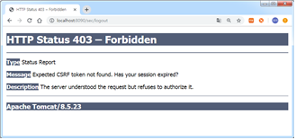
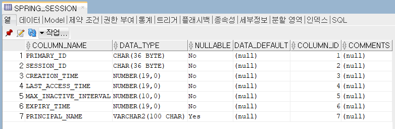

## spring security

### reference

- [스프링 시큐리티 아키텍처](https://docs.spring.io/spring-security/reference/servlet/architecture.html)
- [스프링 시큐리티 시작](https://docs.spring.io/spring-security/reference/getting-spring-security.html)
- [Cross Site Request Forgery (CSRF) Protection](https://docs.spring.io/spring-security/reference/servlet/exploits/csrf.html)
- [인증,인가](https://docs.spring.io/spring-security/reference/features/index.html)

### 작업순서

1. spring security starter 추가

```xml
		<dependency>
			<groupId>org.springframework.boot</groupId>
			<artifactId>spring-boot-starter-security</artifactId>
		</dependency>
		<dependency>
			<groupId>org.springframework.security</groupId>
			<artifactId>spring-security-test</artifactId>
			<scope>test</scope>
		</dependency>
		<dependency>
			<groupId>org.thymeleaf.extras</groupId>
			<artifactId>thymeleaf-extras-springsecurity6</artifactId>
		</dependency>
```

2. security config

```java
import org.springframework.context.annotation.Bean;
import org.springframework.context.annotation.Configuration;
import org.springframework.security.config.annotation.web.builders.HttpSecurity;
import org.springframework.security.config.annotation.web.configuration.EnableWebSecurity;
import org.springframework.security.core.userdetails.User;
import org.springframework.security.core.userdetails.UserDetails;
import org.springframework.security.core.userdetails.UserDetailsService;
import org.springframework.security.crypto.bcrypt.BCryptPasswordEncoder;
import org.springframework.security.crypto.password.PasswordEncoder;
import org.springframework.security.provisioning.InMemoryUserDetailsManager;
import org.springframework.security.web.SecurityFilterChain;
import org.springframework.security.web.access.AccessDeniedHandler;
import org.springframework.security.web.authentication.AuthenticationSuccessHandler;

@Configuration
@EnableWebSecurity
public class WebSecurityConfig {

	@Bean
	PasswordEncoder passwordEncoder() {
		return new BCryptPasswordEncoder();
	}

	@Bean
	public SecurityFilterChain securityFilterChain(HttpSecurity http) throws Exception {
		http
			.authorizeHttpRequests((requests) -> requests
				.requestMatchers("/", "/home", "/css/*", "/js/*", "/assets/*").permitAll()
				.requestMatchers("/admin/*").hasRole("ADMIN")
				.anyRequest().authenticated()
			)
			.formLogin((form) -> form
				.permitAll()
			)
			.logout((logout) -> logout.deleteCookies("JSESSIONID").permitAll())
			//.csrf(csrf -> csrf.disable())
			.csrf((csrf) -> csrf.ignoringRequestMatchers("/api/*")   );
			;

		return http.build();
	}

  //메모리 기반으로 인증
	@Bean
	public UserDetailsService userDetailsService() {
		UserDetails user =
			 User.withDefaultPasswordEncoder()
				.username("user")
				.password("1111")
				.roles("USER")
				.build();
		UserDetails admin =
				 User.withDefaultPasswordEncoder()
					.username("admin")
					.password("1111")
					.roles("ADMIN")
					.build();

		return new InMemoryUserDetailsManager(user,admin);
	}
}
```

### 테이블 생성

```sql
CREATE TABLE T_ROLE (
     ID           number primary key,
     ROLE_NAME  varchar2(100) not null,
     DESCRIPTION varchar2(100)
 );

 CREATE TABLE T_USER (
  ID           number primary key,
  LOGIN_ID    varchar2(20)   not null,
  PASSWORD  varchar2(200)  not null,
  FULL_NAME  varchar2(100)  not null,
  DEPT_NAME  varchar2(100)  not null
);

 CREATE TABLE T_USER_ROLE (
  ROLE_ID number,
  USER_ID number,
  foreign key (role_id) references t_role(id),
  foreign key (user_id) references t_user(id),
  primary key(role_id, user_id)
);

--///데이터 입력
 insert into t_user values( 1,'user', '1234', '사용자', '인사');
 insert into t_user values( 2,'admin', '1234', '관리자', '기획');

 insert into t_role values(1, 'ROLE_USER', '일반사용자');
 insert into t_role values(2, 'ROLE_ADMIN', '시스템관리자');

 insert into t_user_role values(1, 1);
 insert into t_user_role values(2, 2);

 commit;

 --update t_user set password = '$2a$16$UAEsMmsluU3m8S/EBUSzP.2G2x3yP87BggZT4bqm2sy1Ri1UmX5ti';
```

### 패스워드 인코딩

```java
public class BcryptTest {

	@Test
	public void test() {
		// Create an encoder with strength 16
		BCryptPasswordEncoder encoder = new BCryptPasswordEncoder(16);
		String result = encoder.encode("1234");
		System.out.println(result);
		assertEquals("1234", result);
	}
}

```

### UserDetails

사용자 정보를 찾아 해당 계정이 사용가능한지, 패스워드의 유효기간이 지나 변경이 필요한지 등의 상세한 사용자 정보(UserDetails)를 조회하기 위한 객체가 필요.

```java
public class UserVO implements UserDetails {
  @override
  public void getPassword(){
     return password;
  }
  @override
  public void getUsername(){
     return id;
  }
  @override
  public Collection<? extends GrantedAuthority> getAuthorities(){
     List<GrantAuthority> auth = new ArrayList<>();
     auth.add(new SimpleGrantedAuthority(this.role)
     return auth;
  }
}
```

### UserDetailsService

로그인 화면에서 사용자 이름을 전달받아 이를 사용해 UserDetails 객체를 만들어 반환하도록 구현된 클래스가 필요함.

```java
@Service
public class CustomUserDetailsService  implements UserDetailsService{

	@Autowired
	UserDAO dao;

	@Override
	public UserDetails loadUserByUsername(String username) throws UsernameNotFoundException {

		UsersVO vo = new UsersVO();
		vo.setName(username);
		vo = dao.getUser(vo);

      //사용자가 존재하지 않는 경우
		if(vo == null) {
			throw new UsernameNotFoundException("no user");
		}

		//권한 지정
		List<GrantedAuthority> auth = new ArrayList<>();
		auth.add(new SimpleGrantedAuthority(vo.getRole()));

		//User 객체 return
		return new SampleUser(username, vo.getPassword(), auth);
	}
}
```

### SecurityConfig

```java
@Configuration
@EnableWebSecurity
public class SecurityConfig {

	@Bean
	public UsersService userService() {
		return new UsersService();
	}

	@Bean
	public PasswordEncoder passwordEncoder() {
		return new BCryptPasswordEncoder();
	}

	@Bean
	public CustomLoginSuccessHandler loginHandler() {
		return new CustomLoginSuccessHandler();
	}

	@Bean
	public AccessDeniedHandler accessDeniedHandler() {
		return new WebAccessDenyHandler();
	}
	@Bean
	public SecurityFilterChain filterChain(HttpSecurity http) throws Exception {
		http.authorizeHttpRequests((requests) ->
							requests
							.antMatchers("/top", "/login").permitAll()
							.antMatchers("/admin/**").hasAuthority("ROLE_ADMIN")
							.anyRequest().authenticated())
				.formLogin().loginPage("/login")
							.usernameParameter("id")
							.successHandler(loginHandler())
							.defaultSuccessUrl("/top")
							.and()
				.logout().logoutUrl("/logout")
					      .logoutSuccessUrl("/top")
						 .invalidateHttpSession(true)
						 .deleteCookies("JSESSIONID")
						 .and()
				.exceptionHandling()
					     .accessDeniedHandler(accessDeniedHandler())
					     .and()
				// .csrf().disable()
				.userDetailsService(userService());

		return http.build();
	}

	@Bean
	public WebSecurityCustomizer webSecurityCustomizer() {
		return (web) -> web.ignoring().antMatchers("/images/**", "/js/**", "/css/**");
	}
}
```

### 로그아웃 페이지 커스텀

```html
<form action="/logout" method="post">
  <input type="submit" value="Log out" />
  <input
    type="hidden"
    th:name="${_csrf.parameterName}"
    th:value="${_csrf.token}"
  />
</form>
```

### 로그인 처리 후 추가작업

```java
public class CustomLoginSuccessHandler implements AuthentocationSuccessHandler {
  @Override
  pblic void onAuthenticationSuccess(HttpServletRequest request, HttpServletResponse
         response, Authentocation authentication) throws IOException, ServletException {

       //로그인 후 추가작업

       response.sendRedirect("top.html")
  }
}
```

### 컨트롤러에서 시큐리티 세션 정보 조회

```java
	@RequestMapping(value = "/", method = RequestMethod.GET)
	public String home(Locale locale,
                      Model model,
                      @AuthenticationPrincipal UserDetails user) {
```

```java
//UserDetails userDetails = (UserDetails)SecurityContextHolder.getContext().getAuthentication().getPrincipal();

  // 시큐리티 컨텍스트 객체를 얻습니다.
SecurityContext context = SecurityContextHolder.getContext();

// 인증 객체를 얻습니다.
Authentication authentication = context.getAuthentication();

// 로그인한 사용자정보를 가진 객체를 얻습니다.
Principal principal = authentication.getPrincipal();

// 사용자가 가진 모든 롤 정보를 얻습니다.
Collection<? extends GrantedAuthority> authorities = authentication.getAuthorities(); Iterator<? extends GrantedAuthority> iter = authorities.iterator();
while (iter.hasNext()) {
    GrantedAuthority auth = iter.next();
    System.out.println(auth.getAuthority());
}
```

### 엑세스 제어

referer

- https://www.thymeleaf.org/doc/articles/springsecurity.html

| Expression                | Description                                                                                                 |
| :------------------------ | :---------------------------------------------------------------------------------------------------------- |
| hasRole([role])           | 현재 로그인한 주체(principal)가 권한을 가지고 있으면 true 반환                                              |
| hasAnyRole([role1,role2]) | 현재 로그인한 주체가 제공된 권한 중 하나라도 가지고 있으면 true 반환 (쉼표로 여러 개의 권한 목록 지정 가능) |
| permitAll()               | 모든 사용자 접근 가능 (Always evaluates to true)                                                            |
| denyAll()                 | 모든 사용자 접근 불가능 (Always evaluates to false)                                                         |
| isAnonymous()             | 현재 로그인한 사용자가 익명 사용자(anonymous user)인 경우 true 반환                                         |
| isRememberMe()            | 현재 로그인한 사용자가 기억하고 있는 사용자(remember-me user)인 경우 true 반환                              |
| isAuthenticated()         | 현재 로그인한 사용자가 익명이 아닌 경우 true 반환 (인증만 되어 있으면 접근 허용)                            |
| isFullyAuthenticated()    | 현재 로그인한 사용자가 익명 또는 기억하고 있는 사용자가 아닌 경우 true 반환                                 |
| principal                 | 현재 로그인한 사용자를 나타내는 객체에 직접 액세스할 수 있다.                                               |
| authentication            | SecurityContext에서 얻은 현재 Authentication 객체에 직접 액세스할 수 있다.                                  |

```html
<!-- security namespace -->
<html
  xmlns:th="http://www.thymeleaf.org"
  xmlns:sec="http://www.thymeleaf.org/extras/spring-security"
>
  <body>
    <!-- authentication 속성 -->
    <span sec:authentication="name">관리자</span>
    <span sec:authentication="principal.username">관리자</span>
    <span sec:authentication="principal.authorities">권한</span>

    <!-- authorize 속성 -->
    <div sec:authorize="isAnonymous()">로그인 전</div>
    <div sec:authorize="isAuthenticated()">로그인된 경우</div>
    <div sec:authorize="hasRole('ROLE_ADMIN')">어드민 권한이 있으면</div>
    <!-- #authentication 객체 이용하여 인증 시 사용된 객체에 대한 정보 -->
    <input th:value="${#authentication.principal.username}" />
  </body>
</html>
```

### CSRF(Cross Site Request Forgery)

CSRF(Cross Site Request Forgery)란 사이트 간 요청 위조 방지하기 위해서 Spring Security가 설정되면 기본적으로 활성화 됨.
Spring Security 의 CSRF protection은 Http 세션과 동일한 생명주기을 가지는 토큰을 발행한 후 Http 요청(PATCH, POST, PUT, DELETE 메서드인 경우)마다 발행된 토큰이 요청에 포함되어 (Http헤더 혹은 파라미터) 있는지 검사하는 가장 일반적으로 알려진 방식의 구현이 설정되어 있다.


#### 폼데이터

```html
<input type="hidden" name="${_csrf.parameterName}" vlue="${_crf.token}" />
```

#### ajax 요청에서 token 전달

```html
<head>
  <meta name="_csrf" content="${_csrf.token}" />
  <!-- default header name is X-CSRF-TOKEN -->
  <meta name="_csrf_header" content="${_csrf.headerName}" />
  <script>
    $(function () {
      var token = $("meta[name='_csrf']").attr("content");
      var header = $("meta[name='_csrf_header']").attr("content");
      $(document).ajaxSend(function (e, xhr, options) {
        xhr.setRequestHeader(header, token);
      });
    });
  </script>
</head>
```

#### Rest API (Ajax 인증검사)

AuthenticationEntryPoint <-- AuthenticationException
AuthenticationSuccessHandler  
AuthenticationFailureHandler  
AccessDeniedHandler <-- AccessDeniedException

referer : https://redcoder.tistory.com/243

#### toast grid에서 토큰 전달

### CORS

Users can integrate the CorsFilter with Spring Security by providing a CorsConfigurationSource

reference

- https://ddonghyeo.tistory.com/56
- https://docs.spring.io/spring-security/reference/servlet/integrations/cors.html

```java
@Bean
UrlBasedCorsConfigurationSource corsConfigurationSource() {
    CorsConfiguration configuration = new CorsConfiguration();
    configuration.setAllowedOrigins(Arrays.asList("https://example.com"));
    configuration.setAllowedMethods(Arrays.asList("GET","POST"));
    UrlBasedCorsConfigurationSource source = new UrlBasedCorsConfigurationSource();
    source.registerCorsConfiguration("/**", configuration);
    return source;
}

@Bean
public SecurityFilterChain apiFilterChain(HttpSecurity http) throws Exception {
	http
		.securityMatcher("/api/**")
		.cors((cors) -> cors
			.configurationSource(apiConfigurationSource())
		)
}
```

### 세션 저장소 관리

문제:  
애플리케이션 재시작되는 경우 세션 정보가 사라지는 문제가 있고, 분산 서버에서는 애플리케이션간에 세션을 공유하지 않는다면 로그인 상태를 유지할 수 없음.
해결:  
애플리케이션 세션을 공유하기 위해 Redis 와 같은 캐시 서버를 활용하거나 JDBC 를 사용해 공유

1. 라이브러리 의존성 추가

```
		<dependency>
			<groupId>org.springframework.session</groupId>
			<artifactId>spring-session-jdbc</artifactId>
		</dependency>
```

2. application.properties의 세션을 저장하기 위한 스키마 생성

```yml
spring.session.jdbc.initialize-schema=always
```


