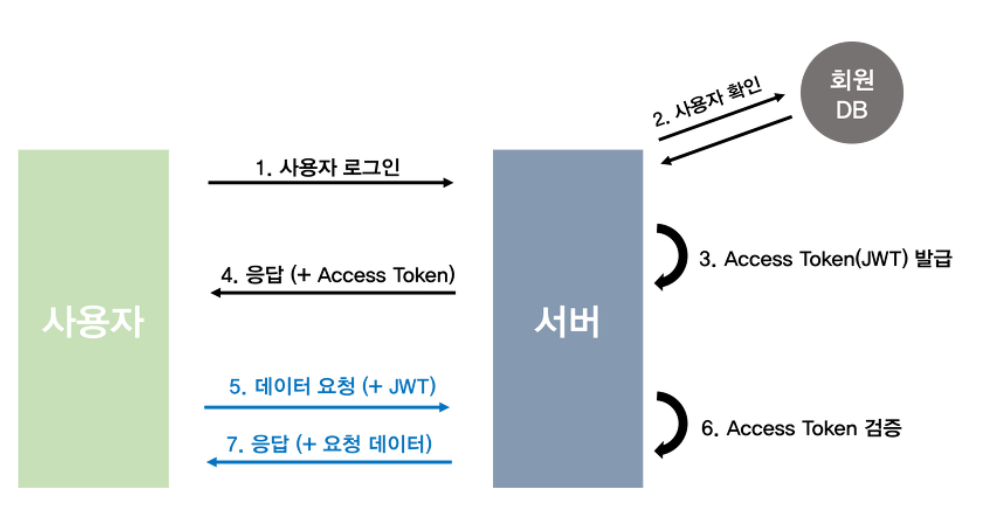
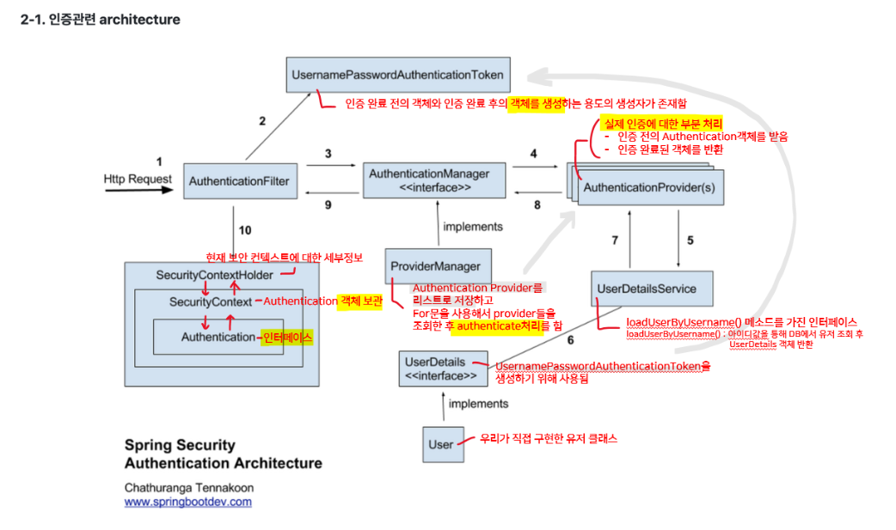

# Spring Security

https://velog.io/@jun7867/%EC%84%B8%EC%84%A0-%EA%B8%B0%EB%B0%98-%EC%9D%B8%EC%A6%9D%EA%B3%BC-%ED%86%A0%ED%81%B0-%EA%B8%B0%EB%B0%98-%EC%9D%B8%EC%A6%9DJWT-%EC%B0%A8%EC%9D%B4%EC%A0%90

인증
- 세션기반인증 : 서버에 로그인 상태를 기억. 동일한 사이트에서 동작. SSR
- 토큰기반인증 : 클라이언트에 로그인 증명을 기억. 특정한 식별문자열(토큰)을 이용해서 사용자 식별. CSR(SPA). 토큰의 포맷은 JWT라는 형식으로 만료시간과 서명을 추가해서 좀 더 안정한 문자열을 사용함. 


```
세션기반인증
ID/PW 검증 -> HttpSession 생성  ->      SessionID발급     ->  사용자정보는 서버 메모리(or redis)에 저장  
                                 클라이언트 쿠키에 저장         session.setAttribute("login", loginVO)

요청(쿠키로 JSESSIONID 같이 보냄)  ->  서버에서 Session ID로 사용자 정보 복원
                                       ${session.loginUser}

```


```토큰기반인증

```




## Security 



Dependency : Spring Boot DevTools, Lombok, spring Data JPA, Oracle Driver, Spring Web, Spring Security


## JWT

```gradle
implementation 'org.springframework.boot:spring-boot-starter-security'
implementation 'io.jsonwebtoken:jjwt-api:0.11.5'
runtimeOnly 'io.jsonwebtoken:jjwt-impl:0.11.5'
runtimeOnly('io.jsonwebtoken:jjwt-jackson:0.11.5') // JSON 직렬화
```
```xml
<!-- Spring Boot Security -->
<dependency>
    <groupId>org.springframework.boot</groupId>
    <artifactId>spring-boot-starter-security</artifactId>
</dependency>

<!-- JWT (jjwt) -->
<!-- JWT 토큰 생성, 파싱 등 API -->
<dependency>
    <groupId>io.jsonwebtoken</groupId>
    <artifactId>jjwt-api</artifactId>
    <version>0.11.5</version>
</dependency>
<!-- 실제 구현체 (runtime 필요) -->
<dependency>
    <groupId>io.jsonwebtoken</groupId>
    <artifactId>jjwt-impl</artifactId>
    <version>0.11.5</version>
    <scope>runtime</scope>
</dependency>

<!--JWT 파싱 시 JSON 처리용 -->
<dependency>
    <groupId>io.jsonwebtoken</groupId>
    <artifactId>jjwt-jackson</artifactId> <!-- or jjwt-gson 가능 -->
    <version>0.11.5</version>
    <scope>runtime</scope>
</dependency>
```
2. JwtUtil   : 토큰생성, 유효성 체크
  └ generateToken
  └ extractUsername
  └ validateToken


**"SecurityConfig에서 허용" + "Jwt 필터에서 제외"*