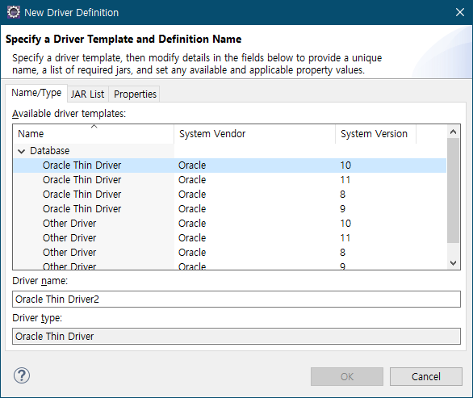
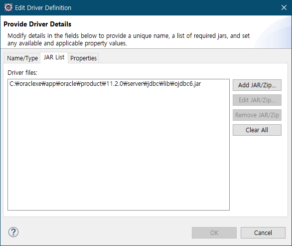

### 공통컴포넌트 사용

1. oracle 사용자 계정 생성  

```sql
create user egov  identified by egov;
grant resource, connect, create view to egov;
```

2. 이클립스 dataSource 지정  

- 접속정보 등록  
  

- 드라이버 선택  
  

- 드라이버(jar) 지정  
  

- DB 연결하여 테스트  
  

- 컴포넌트 추가 : file-> new -> Add EgovFrame Common Compononent  
  

- 테이블 생성 선택   
  

- 데이터소스 선택하고 테이블 생성  
  


### 공통컴포넌트 패키지 정의서  
https://www.egovframe.go.kr/home/ntt/nttRead.do?pagerOffset=20&searchKey=&searchValue=&menuNo=75&bbsId=3&nttId=561  

```
egovframework.rte.....: Runtime Environment (실행환경)
egovframework.rte.fdl : Foundation layer (공통기반) 
egovframework.rte.itl : Integration layer (연계)
egovframework.rte.psl : Persistence layer (데이터처리)
egovframework.rte.ptl : Presenation layer (화면처리)
```

용어명 : [행정표준용어](www.adams.go.kr)를 기준으로 명명    
Java Coding Convention : [오라클 코딩 규칙](www.oracle.com/technetwork/java/codeconvtoc-136057.html)  
