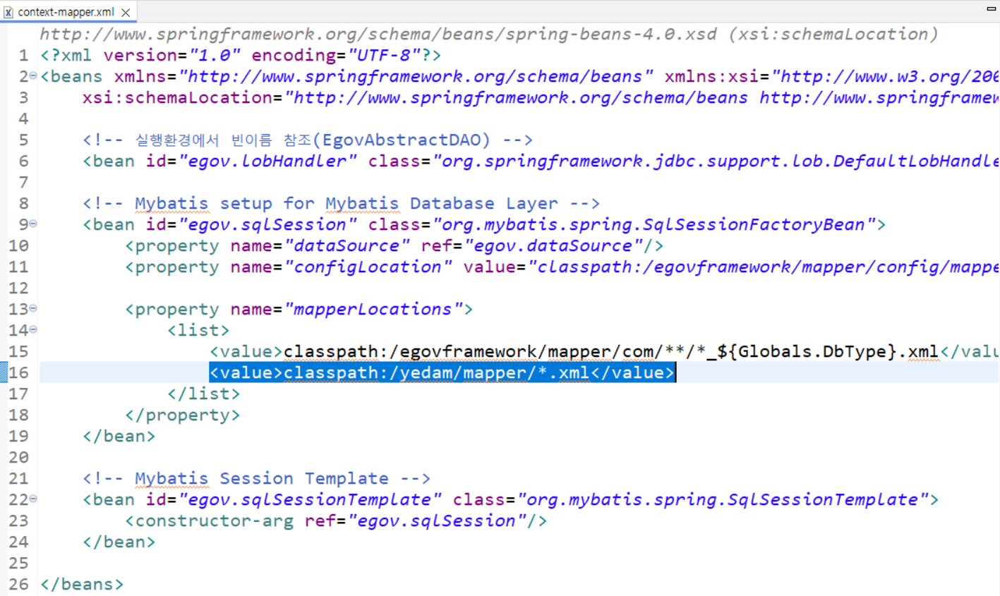
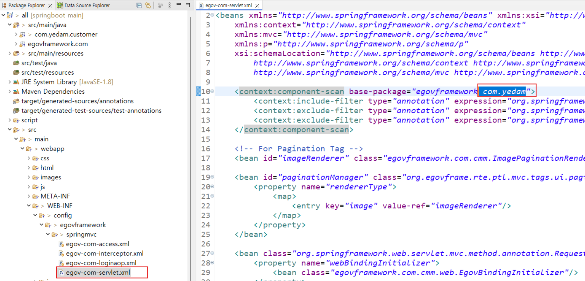
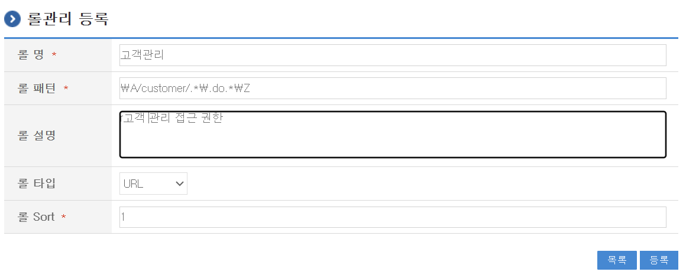
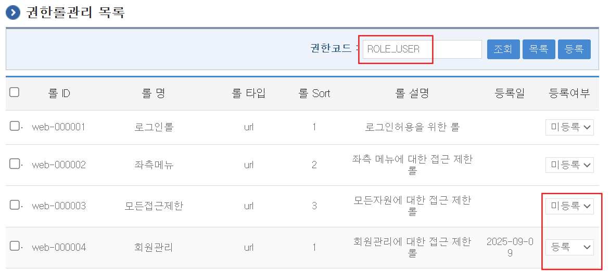
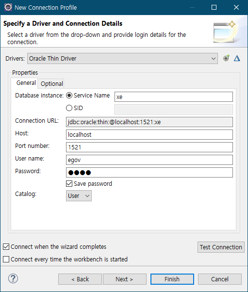

# EgovFrame

### eGovFrame Template Porject

1. Common All-in-one  
   

2. project name, Group id 입력  
   

3. 데이터베이스 사용자 계정 생성

   ```sql
   ALTER SESSION SET "_ORACLE_SCRIPT"=true;
   create user com identified by com01;
   grant resource, connect to com;
   ALTER USER com DEFAULT TABLESPACE USERS QUOTA UNLIMITED ON USERS;
   ```

   

4. DDL, DML 스크립트 실행  
   
5. 패키지 표현방식 -> 계층형  
   

6. properoies 파일에서 dbtyp을 오라클로 변경  
   
7. 컨트롤러, 서비스, DAO, 매퍼XML 생성  
   

8. 패키지 스캔 경로 추가  
   

9. 서비스, DAO 패키지 경로 추가(context-common.xml)  
   

10. 매퍼 XML 경로 추가(context-mapper.xml)  
    

11. 컨트롤러 패키지 경로 추가 (egov-com-servlet.xml)
    

12. Exceptionresolver 빈 주석 처리(에러메시지 보이도록 함)
    

13. error 페이지  
    

14. 로그 레벨 제어  
    
15. 권한 제어

- 권한그룹관리 : 사용자에게 권한 부여
- 권한 계층  
  

  ```sql
  SELECT a.CHLDRN_ROLE as child, a.PARNTS_ROLE parent
    FROM COMTNROLES_HIERARCHY a LEFT JOIN COMTNROLES_HIERARCHY b on (a.CHLDRN_ROLE = b.PARNTS_ROLE);

  SELECT a.ROLE_PTTRN url, b.AUTHOR_CODE authority
  FROM COMTNROLEINFO a, COMTNAUTHORROLERELATE b
  WHERE a.ROLE_CODE = b.ROLE_CODE
  AND a.ROLE_TY = 'url' ORDER BY a.ROLE_SORT;
  ```

    
  

- 롤관리
  고객관리 페이지 접근권한  
  

  메인화면 접근권한  
  

  롤 정규표현식  
  

- 권한관리 : 권한에 롤을 부여  
  ROLE_USER에게 모든 접근제한 미등록, 회원관리, 고객관리, 메인페이지 권한 등록  
  

  


### 공통컴포넌트 사용

1. oracle 사용자 계정 생성

```sql
ALTER SESSION SET "_ORACLE_SCRIPT"=true;
create user com identified by com01;
grant resource, connect , create view to com;
ALTER USER com DEFAULT TABLESPACE USERS QUOTA UNLIMITED ON USERS;
```

2. 이클립스 dataSource 지정

- 접속정보 등록  
  

- 드라이버 선택  
  

- 드라이버(jar) 지정  
  

- DB 연결하여 테스트  
  

- 컴포넌트 추가 : file-> new -> Add EgovFrame Common Compononent  
  

- 테이블 생성 선택  
  

- 데이터소스 선택하고 테이블 생성  
  

### 공통컴포넌트 패키지 정의서

https://www.egovframe.go.kr/home/ntt/nttRead.do?pagerOffset=20&searchKey=&searchValue=&menuNo=75&bbsId=3&nttId=561

```
egovframework.rte.....: Runtime Environment (실행환경)
egovframework.rte.fdl : Foundation layer (공통기반)
egovframework.rte.itl : Integration layer (연계)
egovframework.rte.psl : Persistence layer (데이터처리)
egovframework.rte.ptl : Presenation layer (화면처리)
```

용어명 : [행정표준용어](www.adams.go.kr)를 기준으로 명명  
Java Coding Convention : [오라클 코딩 규칙](www.oracle.com/technetwork/java/codeconvtoc-136057.html)


### 컴포넌트 추가
파일위치 : src\main\resources\egovframework\egovProps\globals.properties  
데이터베이스 기본계정은 com/com01   

Globals.MainPage  =/EgovContent.do  

### 브라우저 테스트
로그인 계정 : USER/rhdxhd12  

### 새로운 기능 추가
1. 테이블 생성  
    ```sql
    create table todo (
      no number primary key,
      title varchar2(100),
      complete char(1) default 'n'
    )
    ```

2. 패키지 생성
    <pre>
    src/main/java
    egovframe.tdo.service      : service, vo,
                 .service.impl : dao, mapper, serviceImpl
                 .web          : controller
              
    </pre>

3. CRUD Program  
mapper(xml) : /src/main/resources/egovframework/mapper   / todo_oracle_Mapper.xml 
view : /egovweb/src/main/webapp/WEB-INF/jsp

4. todoMapper.xml
```xml
```

5. TodoServiceImpl.java
```java
@Service("todoService")
public class TodoServiceImpl extends EgovAbstractServiceImpl implements
        TodoService {
        
    private static final Logger LOGGER = LoggerFactory.getLogger(TodoServiceImpl.class);

//    @Resource(name="todoMapper")
//    private TodoMapper todoDAO;
    
    @Resource(name="todoDAO")
    private TodoDAO todoDAO;
```
## MyBatis 적용

### reference  
- 실행환경 > MyBatis > [표준프레임워크 기반 적용 가이드](https://www.egovframe.go.kr/wiki/doku.php?id=egovframework:rte2:psl:dataaccess:mybatisguide)  
- 기술지원 > [적용지원서비스](https://www.egovframe.go.kr/home/sub.do?menuNo=67) > 이용절차 3단계 > 가이드 다운로드

### MyBatis 사용을 위한 XML 설정파일 3가지

1. MyBatis 공통설정파일 ( `<configuration> ~ </configuration>` )  
2. SQL 매핑파일 ( `<mapper> ~ </ mapper >` )  
3. SqlSessionFactoryBean 빈설정     

    ```xml
	<!-- Mybatis setup for Mybatis Database Layer -->
	<bean id="egov.sqlSession" class="org.mybatis.spring.SqlSessionFactoryBean">		
		<property name="dataSource" ref="egov.dataSource"/>
		<property name="configLocation" value="classpath:/egovframework/mapper/config/mapper-config.xml" />
		
		<property name="mapperLocations">
			<list>
				<value>classpath:/egovframework/mapper/com/**/*_${Globals.DbType}.xml</value>
				<value>classpath:/egovframework/mapper/tdo/**/*.xml</value>
			</list>
		</property>
	</bean>
	
	<alias name="egov.sqlSession" alias="sqlSession"/>
    ```


### MyBatis 적용
1. EgovAbstractMapper 클래스 상속/확장  
    ```java
    @Repository("employeeMapper")
    public class EmployeeMapper extends EgovAbstractMapper { … }
    ```

2. Mapper Interface 방식
    ```java
    @Mapper("employeeMapper")
    public interface EmployeeMapper { … }
    ```
### MyBatis Mapper Interface 사용을 위한 설정

1. pom.xml 변경  

    ```xml
    <dependency>
      <groupId>egovframework.rte</groupId>
      <artifactId>egovframework.rte.psl.dataaccess</artifactId>
      <version>2.7.0</version>
    </dependency>
    ```

    기존의 dataaccess 주석처리하고 dependency 추가. groupId가 변경되었음  

2. MapperConfigurer 빈설정
    ```xml
    <!-- MapperConfigurer setup for MyBatis Database Layer -->
    <bean class="egovframework.rte.psl.dataaccess.mapper.MapperConfigurer">
    <property name="basePackage" value=" 스캔할 Mapper Interface가 속한 풀패키지명" />
    </bean>
    ```

3. @Mapper 패키지 import 변경
    ```java
    import egovframework.rte.psl.dataaccess.mapper.Mapper;  // import 변경

    @Mapper("todoMapper")
    public interface TodoMapper { … }
    ```   