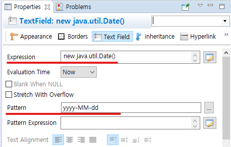

## jasperReport 연동

### 라이브러리 의존성
```xml
		<dependency>
		 <groupId>net.sf.jasperreports</groupId>
		 <artifactId>jasperreports</artifactId>
		 <version>7.0.3</version>
		</dependency>
		<dependency>
			<groupId>net.sf.jasperreports</groupId>
			<artifactId>jasperreports-pdf</artifactId>
			<version>7.0.3</version>
		</dependency>
```

### spring
```java
     	// jasper에 띄울 데이터 date에 맞춰 받아오기
			//List<BoardStatus> result = boardService.getStatus(date);
			
         // 받아온 데이터를 jasper datasource로 등록
			//JRBeanCollectionDataSource beanCollectionDataSource = new JRBeanCollectionDataSource(result);

         
         // return 방식1. 컴파일된 pdf파일을 현재 폴더에 생성
//			JasperExportManager.exportReportToPdfFile(report, "BoardStatus.pdf");
//			return "generated";
```

### ViewResolver 이용
```java

import java.util.Collection;
import java.util.Map;

import org.springframework.core.io.ClassPathResource;
import org.springframework.core.io.Resource;
import org.springframework.web.servlet.view.AbstractView;

import jakarta.servlet.http.HttpServletRequest;
import jakarta.servlet.http.HttpServletResponse;
import net.sf.jasperreports.engine.JasperCompileManager;
import net.sf.jasperreports.engine.JasperExportManager;
import net.sf.jasperreports.engine.JasperFillManager;
import net.sf.jasperreports.engine.JasperPrint;
import net.sf.jasperreports.engine.JasperReport;
import net.sf.jasperreports.engine.data.JRBeanCollectionDataSource;

public class JasperPdfView extends AbstractView {

    private Resource reportResource;      // JRXML 위치
     
    public JasperPdfView(String path) {
    	this.reportResource = new ClassPathResource(path);
    	setContentType("application/pdf");
    }

    @Override
    protected void renderMergedOutputModel(Map<String, Object> model, HttpServletRequest request, HttpServletResponse response) throws Exception {

        // 1. 데이터 소스 생성
        Collection<?> items = (Collection<?>) model.get("datas");
        JRBeanCollectionDataSource dataSource = new JRBeanCollectionDataSource(items);

        // 2. JRXML 컴파일
        JasperReport jasperReport = JasperCompileManager.compileReport(reportResource.getInputStream());

        // 3. PDF 생성
        JasperPrint jasperPrint = JasperFillManager.fillReport(jasperReport, model, dataSource);

        // 4. PDF 브라우저 출력
        response.setContentType(getContentType());
        JasperExportManager.exportReportToPdfStream(jasperPrint, response.getOutputStream());
    }
}
```
```java
	@GetMapping("report2")
	public ModelAndView report2() {
		// view 지정
		ModelAndView mv = new ModelAndView(new JasperPdfView("reports/emp.jrxml"));
		
		// 파라미터
		mv.addObject("P_EMPNAME", "hong gildong");
		
		// 데이터 조회
		EmpVO vo = new EmpVO();
		vo.setFirst(1);
		vo.setLast(10);
		mv.addObject("datas", empService.selectEmp(vo));
		
		return mv;
	}
```

### content type 지정
```java
	// view 지정
	JasperPdfView view = new JasperPdfView("reports/emp.jrxml");
	view.setContentType("application/octet-stream");
	//view.setContentType("application/pdf");
	ModelAndView mv = new ModelAndView(view);
```

### TextFiled
- 날짜 포맷 변경  



### reference
- ★ https://a-curious.tistory.com/97  
- https://www.javatips.net/api/net.sf.jasperreports.engine.jrexporter  
- https://velog.io/@onerain130/2.-Jasper-Report-Spring-boot-연동-구현-코드  
- https://galid1.tistory.com/565               파일다운로드  
- https://community.jaspersoft.com/forums/topic/68701-update-jrpdfexporter-jrexporterparameter-to-jasperreports-library-700/  

