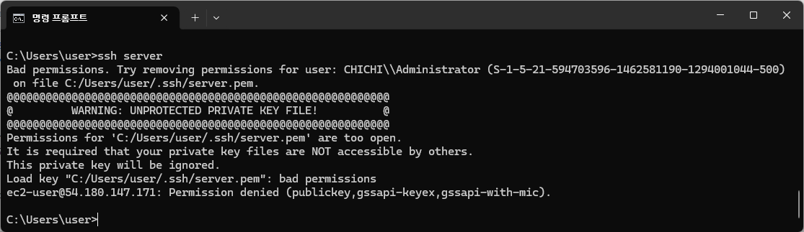
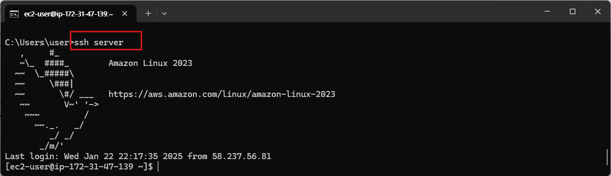
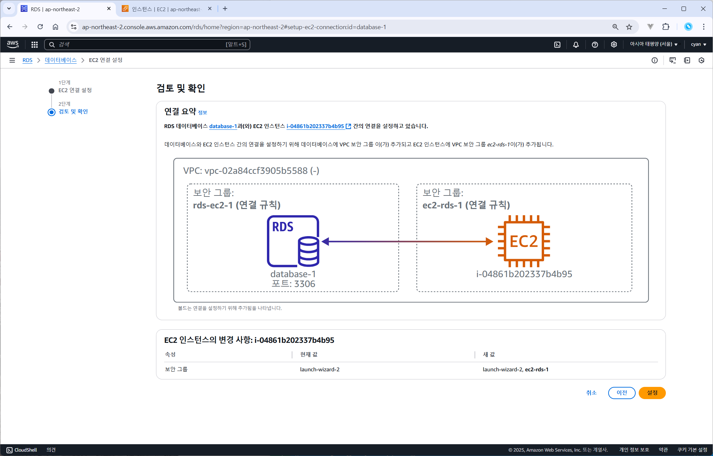

# MSA

### 오픈소스도구

| 디자인패턴              | 스프링부트      | 스프링클라우드                               | 쿠버네티스                       | 이스티오                       |
| :---------------------- | :-------------- | :------------------------------------------- | :------------------------------- | :----------------------------- |
| 서비스 검색             |                 | 넥플릭스 유레카와 스프링클라우드 로드 밸런서 | kube-proxy와 서비스 리소스       |                                |
| 에지 서버               |                 | 스프링 클라우드, 스프링 시큐리티 OAuth       | 쿠버네티스 인그레스 컨트롤러     | 이스티오 인그레스 게이트웨이   |
| 리액티브 마이크로서비스 | 스프링 웹플럭스 |                                              |                                  |                                |
| 구성 중앙화             |                 | 스프링 컨피크 서버                           | 쿠버네티스 컨피그맵과 시크릿     |                                |
| 로그 분석 중앙화        |                 |                                              | 일래스틱서치, 플루언티드, 키바나 |                                |
| 분산 추적(디버깅)       |                 | 스프링 클라우드 슬루스, 집킨                 |                                  | 예거                           |
| 서킷 브레이커           |                 | Resilience4j                                 |                                  | 이상감지(Outier detection)     |
| 제어루프                |                 |                                              | 쿠버네티스의 컨트롤러 매니저     |                                |
| 모니터링 및 경고 중앙화 |                 |                                              |                                  | 카일리, 그라파나, 프로메티우스 |

#### 스프링 웹플럭스(WebFlux)

#### 넥플릭스 유레카(Eureka)

#### 스프링클라우드 로드 밸런서

#### 스프링 컨피크 서버(spring Config Server)

#### 스프링 클라우드 슬루스(Sleuth)

스프링 클라우드 프로젝트는 유입되는 HTTP 요청을 상관관계 ID라고 알려진 추적ID(traceID)로 측정한다. 이 작업을 위해 필터를 추가하고 다른 스프링 컴포넌트와 상호작용하여 생성된 상관관계ID를 모든 시스템에 호출한다

#### 집킨(Zipkin)

집킨은 여러 서비스 간의 트랜잭션 흐름을 보여 주는 오픈 소스 데이터 시각화 도구다. 집킨을 사용하면 트랜잭션을 컴포넌트별로 분해하고 성능 병목점을 시각적으로 확인할 수 있다.

#### ELK 스택

LK 스택은 세개의 오픈 소스 도구인 일레스틱서치, 로그스태시, 키바나를 결합하여 실시간으로 로그를 분석, 검색, 시각화 할 수 있다

#### 일래스틱서치

모든 유형의 데이터(정형, 비정형, 숫자, 텍스트 기반 데이터 등)를 위한 분산 분석 엔진

#### 플루언티드

#### 키바나

일레스틱서치용 시각화 및 데이터 관리 도구이며 차트와 맵, 실시간 히스토그램을 제공한다.

Spring Boot with Docker
https://spring.io/guides/gs/spring-boot-docker

### docker image 생성

mvnw spring-boot:build-image -Dspring-boot.build-image.imageName=cyannara/spring-boot-docker2

명령어:  
docker exec -it [컨테이너 id] /bin/bash

error:  
OCI runtime exec failed: exec failed: unable to start container process: exec: "/bin/sh": stat /bin/sh: no such file or directory: unknown

해결책:
docker의 image가 alpine이면 /bin/bash를 지원하지 않을 수도 있다는 내용을 발견했다.
그리고 /bin/sh로 다시 입력

### window hosts 파일 확인

> type C:\Windows\System32\drivers\etc\hosts

192.168.45.63 host.docker.internal
192.168.45.63 gateway.docker.internal

컨테이너에서 호스트로 접근하기 (localhost는 안됨)
$ curl host.docker.internal:3001

### ubuntu ssh 설정

- .ssh 폴더 생성하고 config 파일 작성

```sh
$ mkdir .ssh
$ cd .ssh
$ vi config
$ chmod 400 server.pem    # <-- 다운받은 pem 파일 복사

```

- config 파일 내용

```
      Host <원하는이름>
      Hostname <ip주소나hostname>
      User ec2-user
      IdentityFile ~/.ssh/server.pem
```

### windows ssh 설정

- windows ssh 폴더 위치에 pem 파일 복사  
  ubuntu 는 **~/.ssh**

    <pre>
      cd %userprofile%/.ssh   
      C:\Users\admin\.ssh  
    </pre>

- config 파일

    <pre>
      Host <원하는이름>
      Hostname <ip주소나hostname>
      User ec2-user
      IdentityFile C:/Users/user/.ssh/server.pem
    </pre>

- ec2 연결  
  

  ```
  속성 -> 보안 탭 -> 고급버튼 -> 상속 사용안함
                     편집버튼 -> 사용자만 남겨놓고 모두 제거
  ```

  

### Amazon RDS의 MySQL ec2에서 접속하기

- RDS 데이터베이스 생성

  

- mysql 클라이언트 설치  
  reference : https://docs.aws.amazon.com/ko_kr/AmazonRDS/latest/UserGuide/mysql-install-cli.html

```sh
$ sudo dnf install mariadb105
```

- mysql 서버 접속

```sh
$ mysql -h database-1.ch86oey80pc7.ap-northeast-2.rds.amazonaws.com -P 3306 -u admin -p
```

### EC2 서버에 프로젝트 배포

reference : https://github.com/jojoldu/freelec-springboot2-webservice
