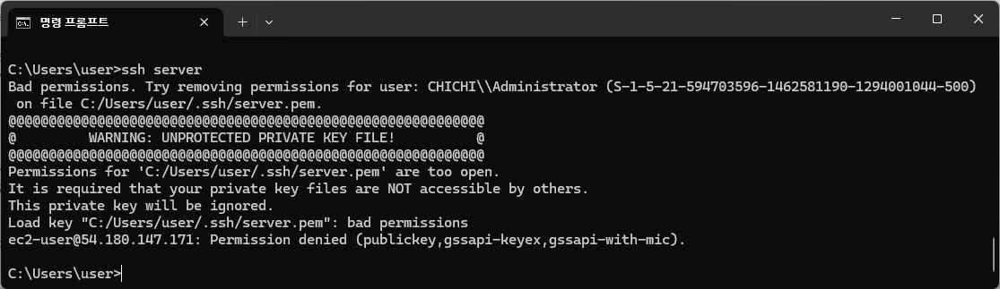
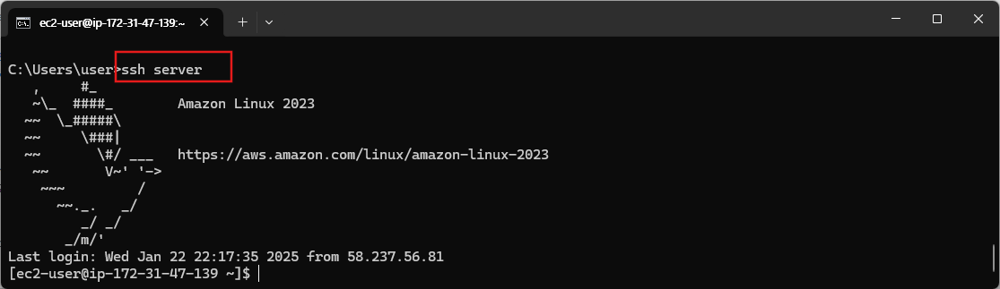
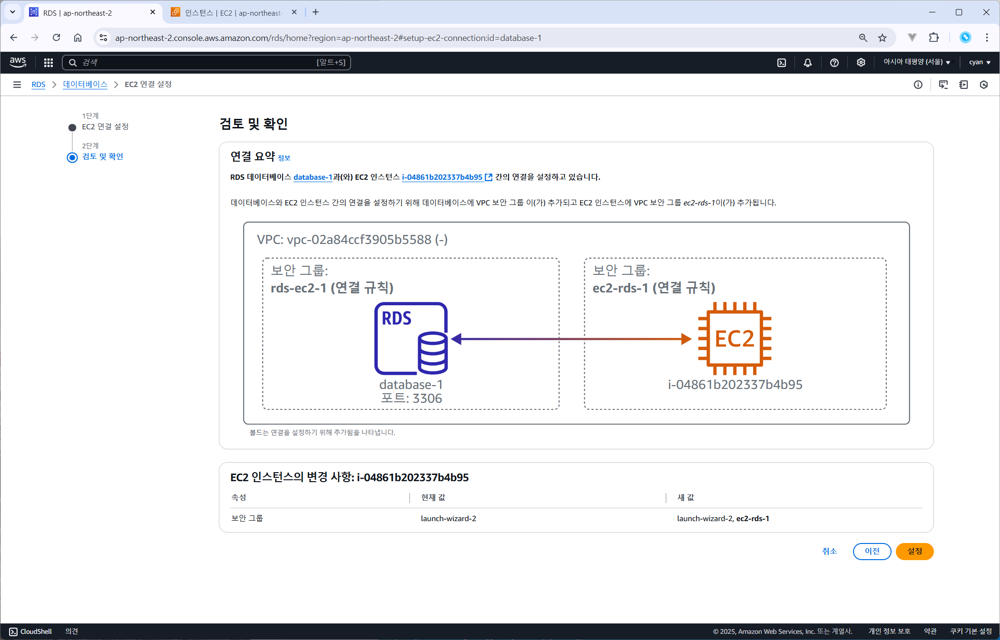

Spring Boot with Docker
https://spring.io/guides/gs/spring-boot-docker

### docker image 생성

mvnw spring-boot:build-image -Dspring-boot.build-image.imageName=cyannara/spring-boot-docker2

명령어:  
docker exec -it [컨테이너 id] /bin/bash

error:  
OCI runtime exec failed: exec failed: unable to start container process: exec: "/bin/sh": stat /bin/sh: no such file or directory: unknown

해결책:
docker의 image가 alpine이면 /bin/bash를 지원하지 않을 수도 있다는 내용을 발견했다.
그리고 /bin/sh로 다시 입력

### window hosts 파일 확인

> type C:\Windows\System32\drivers\etc\hosts

192.168.45.63 host.docker.internal
192.168.45.63 gateway.docker.internal

컨테이너에서 호스트로 접근하기 (localhost는 안됨)
$ curl host.docker.internal:3001

### ubuntu ssh 설정

- .ssh 폴더 생성하고 config 파일 작성

```sh
$ mkdir .ssh
$ cd .ssh
$ vi config
$ chmod 400 server.pem    # <-- 다운받은 pem 파일 복사

```

- config 파일 내용

```
      Host <원하는이름>
      Hostname <ip주소나hostname>
      User ec2-user
      IdentityFile ~/.ssh/server.pem
```

### windows ssh 설정

- windows ssh 폴더 위치에 pem 파일 복사  
  ubuntu 는 **~/.ssh**

    <pre>
      cd %userprofile%/.ssh   
      C:\Users\user\.ssh  
    </pre>

- config 파일

    <pre>
      Host <원하는이름>
      Hostname <ip주소나hostname>
      User ec2-user
      IdentityFile C:/Users/user/.ssh/server.pem
    </pre>

- ec2 연결  
  

  ```
  속성 -> 보안 탭 -> 고급버튼 -> 상속 사용안함
                     편집버튼 -> 사용자만 남겨놓고 모두 제거
  ```

  

### Amazon RDS의 MySQL ec2에서 접속하기

- RDS 데이터베이스 생성

  

- mysql 클라이언트 설치  
  reference : https://docs.aws.amazon.com/ko_kr/AmazonRDS/latest/UserGuide/mysql-install-cli.html

```sh
$ sudo dnf install mariadb105
```

- mysql 서버 접속

```sh
$ mysql -h database-1.ch86oey80pc7.ap-northeast-2.rds.amazonaws.com -P 3306 -u admin -p
```

### EC2 서버에 프로젝트 배포

reference : https://github.com/jojoldu/freelec-springboot2-webservice
