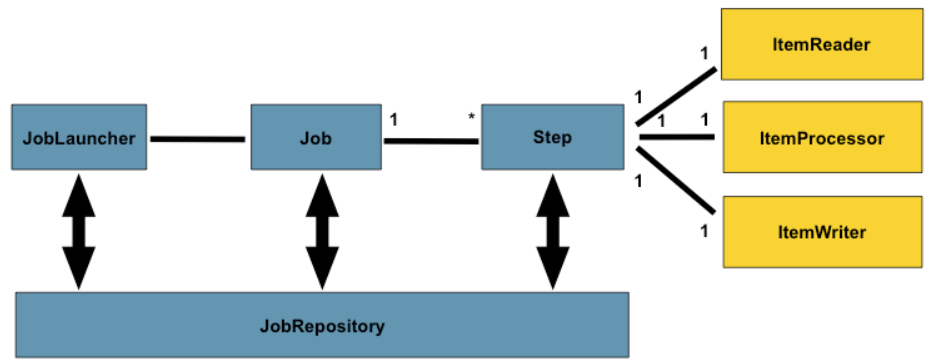

#  스프링부트가 제공하는 API관련 유틸리티 ( HATEOAS, Swagger, Actuator)

### HATEOAS
Hypermedia As The Engine of Application State  
Hypermedia(링크)를 통해서 다음 가능한 행동(action)에 대한 정보를 응답 본문에 넣어주어야 한다.  추가정보를 제공  

- REST 성숙도 모델(Richardson) [참조](https://g4daclom.tistory.com/163)
  - Level 0: 
  - Level 1: 리소스별로 고유한 URI를 사용  
  - Level 2: HTTP 메소드 원칙 준수  
  - Level 3: HATEOAS 원칙 준수  
  - Level 4

### Swagger
Swagger : REST API Documentation을 위해 사용  

### Actuator
Actuator : 내장 톰캣의 상태를 모니터링 할 수 있는 기능  


## HATEAOS
1. add dependency 

```xml
<!-- https://mvnrepository.com/artifact/org.springframework.boot/spring-boot-starter-hateoas -->
<dependency>
    <groupId>org.springframework.boot</groupId>
    <artifactId>spring-boot-starter-hateoas</artifactId>
    <version>3.4.3</version>
</dependency>
```

2. Controller에 HATEAOS 관련 코드 추가


| 측면 | Swagger | HATEOAS |
| :-- | :-- |:----- |
| API 문서화 | Swagger는 소비자가 사용 가능한 엔드포인트, 요청 매개변수 및 응답을 사전에 이해할 수 있도록 UI를 갖춘 자세하고 인간이 읽을 수 있는 API 문서를 제공합니다. | HATEOAS는 서버에서 응답 내에 반환된 하이퍼미디어 링크에 의존하므로 문서화가 더 암묵적입니다. 따라서 소비자는 생성을 통해 이러한 링크를 통해 동적으로 작업을 발견합니다. |
| 클라이언트 측 구현 | 클라이언트는 일반적으로 Swagger 사양을 기반으로 생성되거나 작성됩니다. API의 구조는 사전에 알려져 있으며, 클라이언트는 미리 정의된 경로에 따라 요청을 할 수 있습니다. | HATEOAS 클라이언트는 응답 내의 하이퍼미디어 링크를 통해 사용 가능한 작업을 발견하여 API와 동적으로 상호작용합니다. 클라이언트는 전체 API 구조를 사전에 알 필요가 없습니다. |
| 유연성 | Swagger는 미리 정의된 엔드포인트와 일관된 API 구조를 기대하고 있어 보다 경직되어 있습니다. 이는 문서 또는 사양을 업데이트하지 않고 API를 발전시키기 어렵게 만듭니다. | HATEOAS는 API가 발전할 수 있도록 더 큰 유연성을 제공하여 하이퍼미디어 기반 응답을 변경하더라도 기존 클라이언트에 영향을 주지 않습니다. |
| 소비자 용이성 | 자동 생성된 문서 또는 API 사양에서 직접 클라이언트 코드를 생성하는 도구에 의존하는 소비자에게는 쉽습니다. | 소비자에게는 더 복잡합니다. 이들은 응답을 해석하고 하이퍼미디어 링크를 따라 개별적으로 작업을 발견해야 합니다. |
| API 발전 | API 구조의 모든 변경은 Swagger 사양을 업데이트하고, 클라이언트 코드를 재생성하며, 사용자가 사용하도록 배포해야 합니다. | HATEOAS는 클라이언트가 하이퍼미디어를 통해 API를 탐색하므로 API가 발전할 때 업데이트가 덜 필요합니다. |
| 버전 관리 | Swagger는 일반적으로 명시적인 버전 관리와 함께 여러 버전의 API를 별도로 유지 관리해야 합니다. | HATEOAS는 클라이언트가 제공된 링크를 따라 동적으로 발전하므로 엄격한 버전 관리 없이 진화할 수 있습니다. |
||||

HATEOAS는 응답에 포함된 하이퍼미디어 링크를 통해 클라이언트를 API 상호작용으로 동적으로 안내하는 데 중점을 두며, Swagger (또는 OpenAPI)는 API의 구조, 엔드포인트 및 작업을 설명하는 정적이고 인간이 읽을 수 있으며 기계가 읽을 수 있는 API 문서를 제공합니다

## Spring Batch

배치 작업이란게 데이터베이스나 api 또는 파일을 읽는 작업을 진행하고, 필요한 내용을 처리한 이후에 다시 파일이나 데이터베이스 같은 곳에 write 하는 작업을 진행.
스프링 배치를 활용하여 개발을 한다면 Job 과 Step, Step의 있는 ItemReader, ItemProcessor, ItemWriter 항목들을 활용하여 개발을 함.

https://docs.spring.io/spring-batch/reference/spring-batch-intro.html

비즈니스 시나리오

- Spring Batch는 다음과 같은 비즈니스 시나리오를 지원합니다.
- 주기적으로 일괄처리 프로세스를 커밋합니다.
- 동시 일괄 처리: 작업의 병렬 처리.
- 단계적 엔터프라이즈 메시지 중심 처리.
- 대규모 병렬 배치 처리.
- 실패 후 수동 또는 예약된 재시작.
- 종속 단계의 순차적 처리(워크플로 기반 배치로 확장 가능).
- 부분 처리: 레코드 건너뛰기(예: 롤백 시).
- 소규모 배치 크기나 기존 저장 프로시저 또는 스크립트가 있는 경우의 전체 배치 트랜잭션입니다.



JobRepository  
JobRepository는 배치 수행을 위한 데이터 (시작 시간, 종료 시간, 상태, 읽기/쓰기, 회수 등) 및 Job의 상태관리를 담당합니다. JobRepository는 스프링 배치 내의 잡런쳐, 잡, 스탭과 같이 컴포넌트들이 데이터를 공유를 하게 됩니다.  
JobLauncher  
잡런처는 잡을 실행해주는 역할을 합니다. 잡이 실행이 되면 JobRepository에는 작업의 따른 데이터들이 갱신이 되겠습니다.  
Job과 Step  
Job은 하나의 배치 작업입니다. 배치 작업을 하나 수행한다고 하면 Job을 수행 하는 개념입니다. 그리고 하나의 Job 안에는 한개의 Step 또는 여러개의 Step이 있을 수 있습니다. Step은 하나의 배치 작업 안에, 여러 단계가 있다면 이걸 나눠 놓은 개념입니다. Step은 ItemReader, ItemProcessor, ItemWriter가 있어서 무언가를 읽고 처리하고 쓰기를 진행하겠습니다.

#### 자동 실행 방지

```
spring.batch.job.enabled = false
```

JobLauncherCommandLineRunner가 활성화 되어 있어서 따로 스케쥴을 걸지 않아도 애플리케이션 시작 시 컨텍스트 내 Job Bean을 찾아 자동으로 실행하고 JobParameters가 없으면 기본으로 생성함.

@BatchAutoConfiguration : 기본적으로 Batch 작업에 필요한 기본 객체들을 빈으로 등록

### actuator job 확인

```
http://localhost:85/actuator/metrics/spring.batch.job
```

Boot 3.x부터는 Actuator의 Batch 전용 엔드포인트가 사라지고, 대신 Micrometer Metrics 방식으로 모니터링하도록 바뀌었습니다. actuator/batch가 deprecated 됨

## Spring Boot Actuator

애플리케이션을 운영 환경(운영 서버, 배포 후 상태 모니터링 등)에서 모니터링하고 관리하는 도구로서 운영 중인 애플리케이션을 관찰하고, 문제를 조기에 발견하며, 안정적인 서비스 운영을 도와준다

1. 애플리케이션 상태 모니터링

   - health 엔드포인트를 통해 DB, 캐시, 외부 API, 디스크 상태 등 서비스의 전반적인 헬스 체크 가능
   - 외부 모니터링 시스템(예: Prometheus, Grafana, AWS CloudWatch)과 연동 가능

2. 운영 지표(메트릭) 제공

   - JVM 메모리 사용량, GC(Garbage Collection) 횟수, 스레드 상태, HTTP 요청 수, 응답 시간 등 성능 지표 수집
   - 마이크로서비스 환경에서 서비스의 상태를 숫자로 관찰하고 알람 설정 가능

3. 애플리케이션 관리

   - env 엔드포인트로 환경 변수 확인
   - loggers 엔드포인트로 런타임에 로깅 레벨 변경
   - beans 엔드포인트로 현재 로드된 빈(bean) 목록 확인
   - mappings 엔드포인트로 컨트롤러 URL 매핑 정보 확인
   - health
   - info
   - metrics
   - loggers

4. DevOps / 운영 자동화

   - CI/CD 파이프라인에서 애플리케이션 상태 점검 후 배포 자동화에 활용
   - 클라우드 오케스트레이션(Kubernetes readiness/liveness probe)에서 사용

#### 라이브러리 추가

```xml
<dependency>
    <groupId>org.springframework.boot</groupId>
    <artifactId>spring-boot-starter-actuator</artifactId>
</dependency>
```

#### properties 설정

```properties
# =============================
# Actuator 기본 설정
# =============================

# 어떤 엔드포인트를 노출할지 지정 (쉼표 구분)
management.endpoints.web.exposure.include=health,info,metrics,beans,env,loggers,mappings

# health 엔드포인트 세부 정보 항상 보이게
management.endpoint.health.show-details=always

# Actuator 엔드포인트 접두사 (기본: /actuator)
management.endpoints.web.base-path=/actuator

# 특정 포트에서만 actuator 노출 (운영에서 보안상 분리할 때 사용)
# management.server.port=9001

# info 엔드포인트에 노출할 정보
info.app.name=DemoApplication
info.app.description=Spring Boot Actuator Example
info.app.version=1.0.0

# 로깅 레벨 확인 및 변경 가능하도록
management.endpoint.loggers.enabled=true
```

https://docs.spring.io/spring-boot/api/rest/actuator/index.html

실습

```bash
curl http://localhost:8080/actuator/health
curl -i http://localhost:8080/actuator/health
curl -iv http://localhost:8080/actuator/health
```


## APIDoc

### reference

https://mageddo.com/tools/yaml-converter  
https://adjh54.tistory.com/561  
https://sjh9708.tistory.com/169  
https://swagger.io/solutions/api-design/

```yaml
dependencies {
  #swagger
	implementation 'org.springdoc:springdoc-openapi-starter-webmvc-ui:2.0.2'
}
```

```xml
	    <dependency>
	        <groupId>org.springdoc</groupId>
	        <artifactId>springdoc-openapi-starter-webmvc-ui</artifactId>
	        <version>2.8.4</version>
	    </dependency>
```

```java

@Tag(name = "Ticket API", description = "티켓 관리 기능 제공")
@RequestMapping("/api")
@Log4j2
@RestController
public class Rest1Controller {

	@Tag(name= "Ticket API")
	@Operation(summary = "티켓조회", description = "티켓정보를 조회합니다.",         responses = {
            @ApiResponse(responseCode = "200", description = "등록 성공"),
            @ApiResponse(responseCode = "400", description = "잘못된 요청")
        })
	@GetMapping("/ticket")
	public Ticket convert1(@RequestBody Ticket ticket) {

		log.info("ticket: "+ticket);
		return ticket;

	}

	@PostMapping("/ticket")
	public Ticket convert(@RequestBody Ticket ticket) {

		log.info("ticket: "+ticket);
		return ticket;

	}

	@PostMapping("/reserve")
	public Reserve comp(@RequestBody Reserve reserve) {

		log.info("owner: " + reserve.getList().get(0).getOwner());
		return reserve;
	}


	@PostMapping("/compMap")
	public JsonNode compMap(@RequestBody JsonNode node) {

		//첫번째 티켓의 owner 출력
		log.info("owner:" + node.get("list").get(0).get("owner").asText() );
		return node;
	}

}
```

```java
@Schema(description = "티켓 정보 DTO")
@Data
public class Ticket {

	@Schema(description = "티켓 고유 ID", example = "12345")
	int tno;

	@Schema(description = "소유자", example = "user12")
	String owner;

	String grade;

	String seatNo;
}

```
