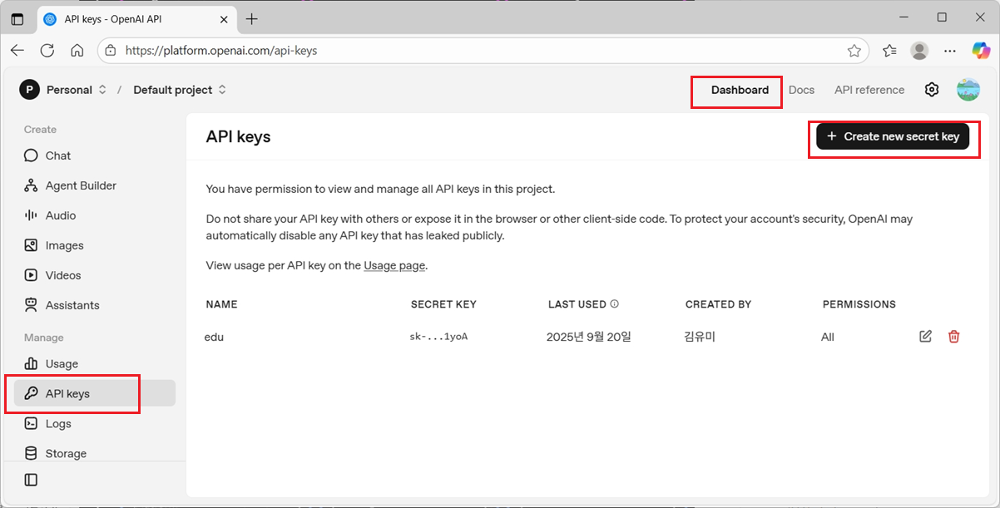
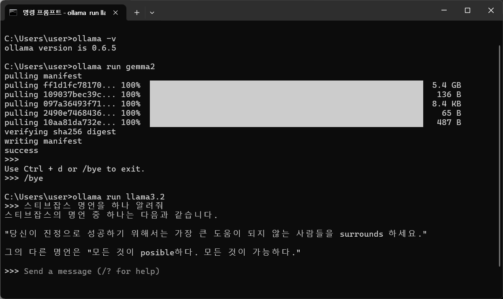
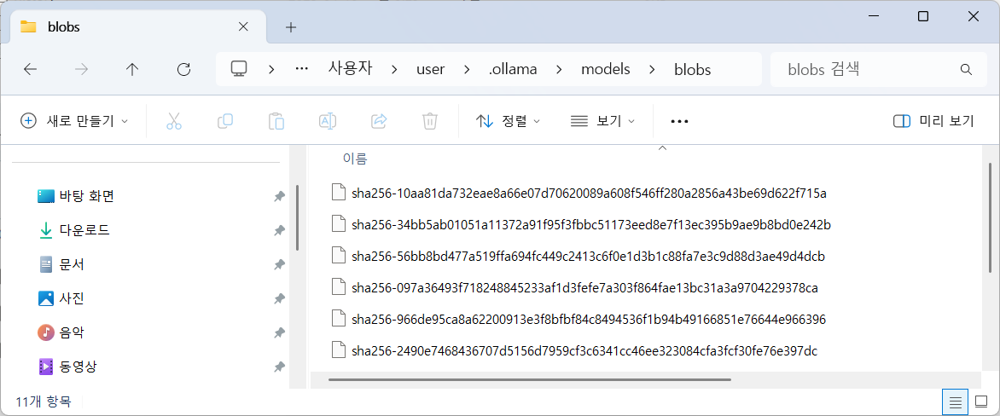

## 프롬프트 엔지니어링(Prompt Engineering)

- 위키백과에서는 프롬프트를 생성형 AI 모델로 해석되고 이해할 수 있는 명령, AI가 수행해야 하는 작업을 설명하는 자연어 텍스트라 정의
- 생성형 AI 모델(예: GPT 계열, Claude, Gemini 등)에게 원하는 출력물을 얻기 위해 프롬프트(질문, 지시문, 입력 텍스트)를 전략적으로 설계, 조정하는 기법
- 단순히 "질문 → 답변" 구조가 아니라, 모델이 맥락, 역할, 제약 조건을 이해하도록 입력을 구성하는 기술
  > 예:
  > 단순 질문 → 2022년 월드컵 우승 팀은 어디야?  
  >  엔지니어링된 질문 → 너는 스포츠 해설가야. 2022년 FIFA 월드컵 우승 팀과 결승 상대를 알려주고, 경기 주요 장면을 3가지 요약해줘.

### 주요 기법

**역할 부여 (Role Prompting)**  
모델에게 정체성을 주어 답변 스타일을 제어

> 예) 당신은 대학 교수입니다. 초보자를 대상으로 인공지능 개념을 쉽게 설명하세요.

**맥락 제공 (Context Setting)**  
모델이 참고할 배경 정보나 조건을 명시

> 예) 아래 데이터는 2022년 경기 통계입니다. 이 데이터를 바탕으로 리포트를 작성하세요.

**출력 형식 지정 (Output Formatting)**  
답변을 목록, JSON, 표, 단계별 설명 등 원하는 구조로 지정합니다.

> 예) 5가지 방법을 번호 목록으로 정리해줘.  
> JSON 형식으로 반환해줘: { "위험도": "높음", "설명": "…" }

**예시 제공 ⇒ One-shot, Few-shot**  
Few-shot: 원하는 답변 예시를 미리 보여주고, 같은 패턴으로 출력하게 함
Zero-shot: 예시 없이 바로 지시.

> 예) Q: 파리의 대표 음식은? A: 바게트.  
> Q: 일본의 대표 음식은?

**사고 연쇄 (CoT, Chain-of-Thought) 유도**  
"단계를 차근차근 설명해라" 같이 reasoning 과정을 강제

> 예) 문제를 단계별로 풀고, 마지막에 정답만 제시해라.

**제약 조건 추가**  
답변 길이, 언어, 전문성 수준 등을 제한

> 예) 200자 이내 한국어 요약문을 작성하라.

## OepnAI API 활용하여 자바기반의 AI 서비스 개발 

referer

- [openai api](https://platform.openai.com/docs/guides/text)
- [github openai-java](https://github.com/openai/openai-java) -> openai-java-example

### Open AI 키발급

키발급


환경변수 등록  


### 라이브러리 설치

```xml
		<dependency>
			<groupId>com.openai</groupId>
			<artifactId>openai-java</artifactId>
			<version>4.8.0</version>
		</dependency>
```

[참고](https://github.com/openai/openai-java/blob/main/openai-java-example/src/main/java/com/openai/example/ResponsesExample.java)

```java
package com.yedam;

import com.openai.client.OpenAIClient;
import com.openai.client.okhttp.OpenAIOkHttpClient;
import com.openai.models.ChatModel;
import com.openai.models.responses.Response;
import com.openai.models.responses.ResponseCreateParams;

public class ResponseExampleTempature {
	public static void main(String[] args) {


		String rolePrompt = """
				너는 초등학생에게 설명하는 친절한 선생님입니다.
				- 쉬운 단어만 사용
				- 예시를 들어서 설명
				- 문장은 2~3문장으로 제한
				""";

		OpenAIClient client = OpenAIOkHttpClient.fromEnv();
		ResponseCreateParams params = ResponseCreateParams.builder()
				    .model(ChatModel.GPT_4_1_NANO)
		        .maxOutputTokens(500)
		        .temperature(0)
		        .instructions(rolePrompt)
		        .input("인터넷이 어떻게 작동하는지 알려줘")
		        .build();

		Response response = client.responses().create(params);

		String result = response.output().get(0)
		        .message().get()
		        .content().get(0)
		        .outputText().get()
		        .text();

		System.out.println(result);

	}
}

```

```java
//응답결과 출력
        response.output().stream()
        .flatMap(item -> item.message().stream())
        .flatMap(message -> message.content().stream())
        .flatMap(content -> content.outputText().stream())
        .forEach(outputText -> System.out.println(outputText.text()));

//응답결과를 문자열 리스트로 변경
List<String> outputs = response.output().stream()
        .flatMap(item -> item.message().stream())
        .flatMap(message -> message.content().stream())
        .flatMap(content -> content.outputText().stream())
        .map(outputText -> outputText.text())
        .toList();
```

### 모델 선택

referer
[API가격](https://openai.com/ko-KR/api/pricing/)
https://platform.openai.com/docs/pricing

### instructions

AI에게 역할(Role)과 행동 규칙을 부여하는 것으로 Python OpenAI에서는 system 또는 system prompt와 같은 개념임

```
role
당신은 창의적인 이야기 작가입니다.
- 이야기의 분위기는 밝고 희망적이어야 합니다.
- 반드시 '은하수', '작은 로봇', '약속'이라는 단어를 포함하세요.
- 문장은 최대 5문장만 작성하세요.

input
모험 이야기를 하나 들려줘.
```

```
role
너는 초등학생에게 설명하는 친절한 선생님이야.
어려운 단어를 쓰지 말고, 쉬운 예시를 들어서 설명해줘.

input
블랙홀은 뭐야?
```

### temperature

temperature는 출력의 창의성(무작위성, 다양성)을 조절하는 매개변수입니다.

| 속성   | 범위      | 설명                                                          |
| :----- | :-------- | :------------------------------------------------------------ |
| 최소   | 0         | 완전히 결정적(Deterministic) → 동일한 입력은 거의 동일한 출력 |
| 일반적 | 0.1 ~ 1.0 | 낮으면 안정적/정확한 답변, 높으면 다양하고 창의적인 답변      |
| 최대   | 2         | (모델에 따라 다름) 매우 무작위적, 창의적, 때로는 엉뚱한 답변  |

## Spring AI

- [오픈소스로 완성하는 AI Full Stack](https://revf.tistory.com/303)

### 라이브러리

```xml
	<properties>
		<spring-ai.version>1.1.0</spring-ai.version>
	</properties>
	<dependencies>
		<dependency>
			<groupId>org.springframework.ai</groupId>
			<artifactId>spring-ai-starter-model-openai</artifactId>
		</dependency>
	</dependencies>

	<dependencyManagement>
		<dependencies>
			<dependency>
				<groupId>org.springframework.ai</groupId>
				<artifactId>spring-ai-bom</artifactId>
				<version>${spring-ai.version}</version>
				<type>pom</type>
				<scope>import</scope>
			</dependency>
		</dependencies>
	</dependencyManagement>
```

### junit 테스트

```java
package com.example.demo;

import org.junit.jupiter.api.BeforeEach;
import org.junit.jupiter.api.Test;
import org.springframework.ai.chat.client.ChatClient;
import org.springframework.beans.factory.annotation.Autowired;
import org.springframework.boot.test.context.SpringBootTest;


@SpringBootTest
public class SpringResponse {

    @Autowired
    private ChatClient.Builder chatClientBuilder;

    private ChatClient chatClient;

    @BeforeEach
    void setUp() {
        this.chatClient = chatClientBuilder.build();
    }

	@Test
	public void test() {

        String response = chatClient.prompt("스티브 잡스의 명언을 한 개 알려줘")
                .call()
                .content();

        System.out.println(response);
	}
}

```

```java
	@Test
	public void test() {
		String role = """
			너는 초등학생에게 설명하는 친절한 선생님이야.
        	어려운 단어를 쓰지 말고, 쉬운 예시를 들어서 설명해줘.
				""";


        String input = """
        	블랙홀은 뭐야?
            """;

        String summary = chatClient.prompt()
        		    .system(role)
                .user(input)
                .call()
                .content();
        System.out.println(summary);
	}


	    // 업종 요약 생성 질문
        String summaryPrompt = """
            다음 기업의 업종 설명을 영업 담당자도 이해하기 쉽게
            핵심만 3줄로 요약해줘.

            [업종 설명]
            %s
            """.formatted(industryRaw);

        String summary = chatClient.prompt()
                .user(summaryPrompt)
                .call()
                .content();
```

System
AI의 행동과 응답 스타일을 안내하며, AI가 입력을 해석하고 응답하는 규칙이나 매개변수를 설정한다. 대화를 시작하기 전에 AI에게 지시 사항을 제공하는 것과 유사하며 역할 부여, 포맷 정의 등이 해당된다.

User
사용자의 입력을 나타낸다. 사용자의 질문, 명령이며 AI의 응답의 기초를 형성하는 중요한 역할을 한다.

Assistant
AI가 사용자 입력에 대해 응답하는 부분이다. 단순한 답변이나 반응 이상으로, 대화의 흐름을 유지하는 데 중요하다. 시스템은 AI의 이전 응답을 추적하여, 일관된 (coherent) 상황에 맞는 상호작용 (interactions)을 보장한다.
Function 대화 중 특정한 작업을 처리하는 역할이다. System이 AI의 전반적인 동작을 설정하는 반면, Function은 사용자가 요청한 특정 작업이나 명령을 수행한다. 대화하는 것 이상의 계산, 데이터 검색 또는 기타 작업을 수행할 필요가 있을 때 특수 기능으로 사용된다.

## 펑션 콜링(Function Calling)

referer

- [openai function calling](https://platform.openai.com/docs/guides/function-calling)

- 거대 언어 모델(LLM)이 단순히 텍스트를 생성하는 것을 넘어서 외부 함수(코드, API)를 안전하고 구조적으로 호출할 수 있도록 하는 메커니즘
- 기존 LLM은 질문에 대해 자연어 답변만 출력
- 펑션 콜링을 쓰면 모델이 답변 대신 미리 정의된 함수 호출 포맷(JSON 등 구조화 데이터)을 반환
- 애플리케이션은 그 함수를 실행하고, 결과를 다시 모델에 전달해서 대화를 이어감

### 작동 원리

1. 도구 - 우리가 모델에 제공하는 기능  
   모델에 프롬프트를 사용하여 API 요청을 보낼 때, 모델이 사용할 수 있는 도구 목록을 포함할 수 있습니다. 예를 들어, 모델이 전 세계 특정 지역의 현재 날씨에 대한 질문에 답할 수 있도록 하려면, 인수로 get_weather사용하는 도구 에 대한 접근 권한을 부여할 수 있습니다.

2. 도구 호출 - 모델이 도구를 사용하도록 요청합니다.  
   함수 호출 이나 도구 호출은 모델이 프롬프트를 조사한 다음 프롬프트의 지침을 따르기 위해 사용 가능한 도구 중 하나를 호출해야 한다고 판단하는 경우 모델에서 얻을 수 있는 특별한 종류의 응답을 말합니다.  
   모델이 API 요청에서 "파리의 날씨는 어때요?"와 같은 프롬프트를 받으면 get_weather도구에 대한 도구 호출로 해당 프롬프트에 응답할 수 있으며 Paris인수로 사용할 수 있습니다

3. 도구 호출 출력 - 모델에 대해 생성하는 출력
   함수 호출 출력 또는 도구 호출 출력은 도구가 모델의 도구 호출 입력을 사용하여 생성하는 응답을 의미합니다.
   모델은 값이 포함된 인수를 포함하는 도구 호출을 반환합니다 -> 도구호출출력을 반환 -> 다음 모든 도구 정의, 원래 프롬프트, 모델의 도구 호출 및 도구 호출 출력을 모델로 다시 보내 최종적으로 다음과 같은 텍스트 응답을 받습니다.

4. 기능과 도구

### 도구 호출 흐름

도구 호출은 OpenAI API를 통해 애플리케이션과 모델 간의 여러 단계로 이루어지는 대화입니다. 도구 호출 흐름은 다음과 같은 다섯 가지 주요 단계로 구성됩니다.

모델에 호출할 수 있는 도구로 요청을 만듭니다.
모델로부터 도구 호출을 받습니다.
도구 호출에서 입력을 받아 애플리케이션 측에서 코드 실행
도구 출력을 사용하여 모델에 두 번째 요청을 만듭니다.
모델로부터 최종 응답을 받음(또는 추가 도구 호출)


## Spring AI 에서 ollama 연동

### ollama 설치

### ollama 로 사용 가능한 모델 찾기

```sh
ollama run llama3.2
```



모델 설치위치 : C:\Users\user\.ollama\models\blobs  


### ollama 명령

| 명령어                         | 설명                                                                           |
| ------------------------------ | ------------------------------------------------------------------------------ |
| `ollama serve`                 | Ollama 서버를 시작합니다. ([Ollama][1])                                        |
| `ollama run <모델>`            | 지정한 모델을 실행하여 프롬프트를 보낼 수 있는 상태로 만듭니다. ([Ollama][1])  |
| `ollama run <모델> <프롬프트>` | 프롬프트를 주면서 모델을 실행하고 응답을 바로 받습니다. ([Ollama][1])          |
| `ollama pull <모델>`           | 원격 레지스트리에서 모델을 다운로드합니다. ([Ollama][1])                       |
| `ollama push <모델>`           | 모델을 레지스트리에 업로드합니다. ([Jason Heo's Blog][2])                      |
| `ollama list` / `ollama ls`    | 로컬에 설치된 모델들을 나열합니다. ([Ollama][1])                               |
| `ollama ps`                    | 현재 실행 중인(런닝) 모델들을 표시합니다. ([Ollama][1])                        |
| `ollama show <모델>`           | 모델에 대한 상세 정보를 보여줍니다. ([Jason Heo's Blog][2])                    |
| `ollama create -f Modelfile`   | Modelfile을 기반으로 커스텀 모델을 생성합니다. ([Ollama][1])                   |
| `ollama rm <모델>`             | 로컬에서 모델을 제거합니다. ([Ollama][1])                                      |
| `ollama stop <모델>`           | 실행 중인 모델을 중지합니다. ([Ollama][1])                                     |
| `ollama --version`             | 설치된 Ollama의 버전을 확인합니다. ([Hostinger][3])                            |
| `ollama help`                  | 전체 명령어 도움말 및 사용 가능한 옵션들을 표시합니다. ([Jason Heo's Blog][2]) |
| `ollama signin`                | Ollama에 로그인합니다. ([Ollama][1])                                           |
| `ollama signout`               | Ollama에서 로그아웃합니다. ([Ollama][1])                                       |

[1]: https://docs.ollama.com/cli?utm_source=chatgpt.com "CLI Reference - Ollama"
[2]: https://jason-heo.github.io/llm/2024/07/07/ollama-tutorial.html?utm_source=chatgpt.com "Ollama quick tutorial (ver. 2024.07)"
[3]: https://www.hostinger.com/tutorials/ollama-cli-tutorial?utm_source=chatgpt.com "Ollama CLI tutorial: Learn to use Ollama in the terminal"

### dependency

```xml
		<dependency>
			<groupId>org.springframework.ai</groupId>
			<artifactId>spring-ai-starter-model-ollama</artifactId>
		</dependency>
```

### properties

```
spring.ai.model.chat=ollama
spring.ai.ollama.base-url=http://localhost:11434
spring.ai.ollama.chat.options.model=llama3.2:latest
spring.ai.ollama.chat.options.temperature=0.7
spring.ai.ollama.init.pull-model-strategy=when_missing
spring.ai.ollama.init.timeout=60s
spring.ai.ollama.init.max-retries=1
```

## RAG

https://wikidocs.net/238531
