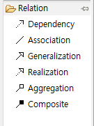
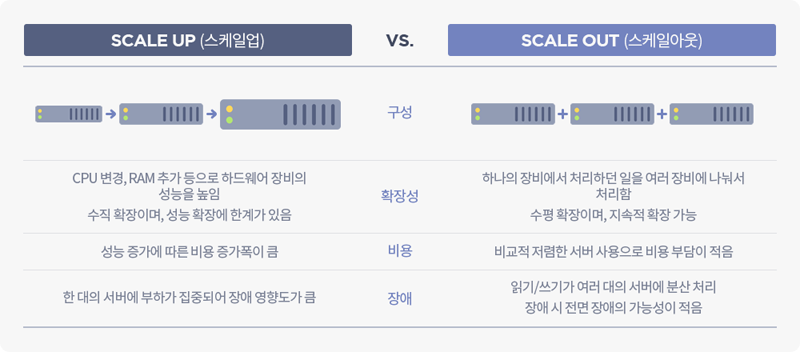

# Spring AI

## 프롬프트 엔지니어링(Prompt Engineering)
생성형 AI 모델(예: GPT 계열, Claude, Gemini 등)에게 원하는 출력물을 얻기 위해 프롬프트(질문, 지시문, 입력 텍스트)를 전략적으로 설계, 조정하는 기법 
단순히 "질문 → 답변" 구조가 아니라, 모델이 맥락, 역할, 제약 조건을 이해하도록 입력을 구성하는 기술
예:
>  단순 질문 → 2022년 월드컵 우승 팀은 어디야?  
  엔지니어링된 질문 → 너는 스포츠 해설가야. 2022년 FIFA 월드컵 우승 팀과 결승 상대를 알려주고, 경기 주요 장면을 3가지 요약해줘.

#### 주요 기법

**역할 부여 (Role Prompting)**   
모델에게 정체성을 주어 답변 스타일을 제어  
> 예) 당신은 대학 교수입니다. 초보자를 대상으로 인공지능 개념을 쉽게 설명하세요.

**맥락 제공 (Context Setting)**  
모델이 참고할 배경 정보나 조건을 명시  
> 예) 아래 데이터는 2022년 경기 통계입니다. 이 데이터를 바탕으로 리포트를 작성하세요.

**출력 형식 지정 (Output Formatting)**  
답변을 목록, JSON, 표, 단계별 설명 등 원하는 구조로 지정합니다.  
> 예) 5가지 방법을 번호 목록으로 정리해줘.  
    JSON 형식으로 반환해줘: { "위험도": "높음", "설명": "…" }

**예시 제공 ⇒ One-shot, Few-shot**  
Few-shot: 원하는 답변 예시를 미리 보여주고, 같은 패턴으로 출력하게 함
Zero-shot: 예시 없이 바로 지시.
> 예) Q: 파리의 대표 음식은? A: 바게트.
    Q: 일본의 대표 음식은?

**사고 연쇄 (CoT, Chain-of-Thought) 유도**  
"단계를 차근차근 설명해라" 같이 reasoning 과정을 강제
> 예) 문제를 단계별로 풀고, 마지막에 정답만 제시해라.

**제약 조건 추가**  
답변 길이, 언어, 전문성 수준 등을 제한
> 예) 200자 이내 한국어 요약문을 작성하라.


## OepnAI API 활용하여 자바기반의 AI 서비스 개발 

referer  
- [openai api](https://platform.openai.com/docs/guides/text?lang=java#choosing-models-and-apis)
- [github openai-java](https://github.com/openai/openai-java)


### Open AI 키발급
키발급  

환경변수 등록  


### 라이브러리 설치
```xml
		<dependency>
			<groupId>com.openai</groupId>
			<artifactId>openai-java</artifactId>
			<version>4.8.0</version>
		</dependency>
```
open ai java -> open ai java client -> core -> jackson  


### 

모델 선택
referer 
[API가격](https://openai.com/ko-KR/api/pricing/)
https://platform.openai.com/docs/pricing


### 펑션 콜링(Function Calling)
referer  
- [openai function calling](https://platform.openai.com/docs/guides/function-calling)

- 거대 언어 모델(LLM)이 단순히 텍스트를 생성하는 것을 넘어서 외부 함수(코드, API)를 안전하고 구조적으로 호출할 수 있도록 하는 메커니즘
- 기존 LLM은 질문에 대해 자연어 답변만 출력
- 펑션 콜링을 쓰면 모델이 답변 대신 미리 정의된 함수 호출 포맷(JSON 등 구조화 데이터)을 반환
- 애플리케이션은 그 함수를 실행하고, 결과를 다시 모델에 전달해서 대화를 이어감

### 작동 원리
1. 도구 - 우리가 모델에 제공하는 기능  
모델에 프롬프트를 사용하여 API 요청을 보낼 때, 모델이 사용할 수 있는 도구 목록을 포함할 수 있습니다. 예를 들어, 모델이 전 세계 특정 지역의 현재 날씨에 대한 질문에 답할 수 있도록 하려면, 인수로 get_weather사용하는 도구 에 대한 접근 권한을 부여할 수 있습니다.

2. 도구 호출 - 모델이 도구를 사용하도록 요청합니다.  
함수 호출 이나 도구 호출은 모델이 프롬프트를 조사한 다음 프롬프트의 지침을 따르기 위해 사용 가능한 도구 중 하나를 호출해야 한다고 판단하는 경우 모델에서 얻을 수 있는 특별한 종류의 응답을 말합니다.  
모델이 API 요청에서 "파리의 날씨는 어때요?"와 같은 프롬프트를 받으면 get_weather도구에 대한 도구 호출로 해당 프롬프트에 응답할 수 있으며 Paris인수로 사용할 수 있습니다

3. 도구 호출 출력 - 모델에 대해 생성하는 출력
함수 호출 출력 또는 도구 호출 출력은 도구가 모델의 도구 호출 입력을 사용하여 생성하는 응답을 의미합니다. 
모델은 값이 포함된 인수를 포함하는 도구 호출을 반환합니다 -> 도구호출출력을 반환 -> 다음 모든 도구 정의, 원래 프롬프트, 모델의 도구 호출 및 도구 호출 출력을 모델로 다시 보내 최종적으로 다음과 같은 텍스트 응답을 받습니다.

4. 기능과 도구

### 도구 호출 흐름
도구 호출은 OpenAI API를 통해 애플리케이션과 모델 간의 여러 단계로 이루어지는 대화입니다. 도구 호출 흐름은 다음과 같은 다섯 가지 주요 단계로 구성됩니다.

모델에 호출할 수 있는 도구로 요청을 만듭니다.
모델로부터 도구 호출을 받습니다.
도구 호출에서 입력을 받아 애플리케이션 측에서 코드 실행
도구 출력을 사용하여 모델에 두 번째 요청을 만듭니다.
모델로부터 최종 응답을 받음(또는 추가 도구 호출)

