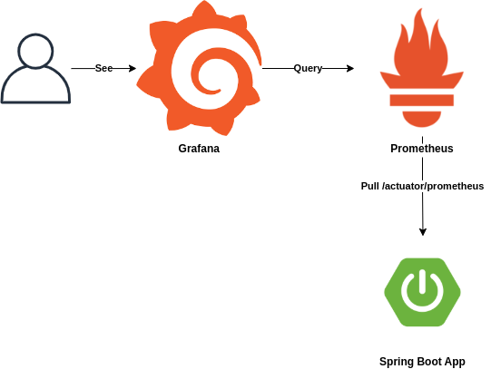
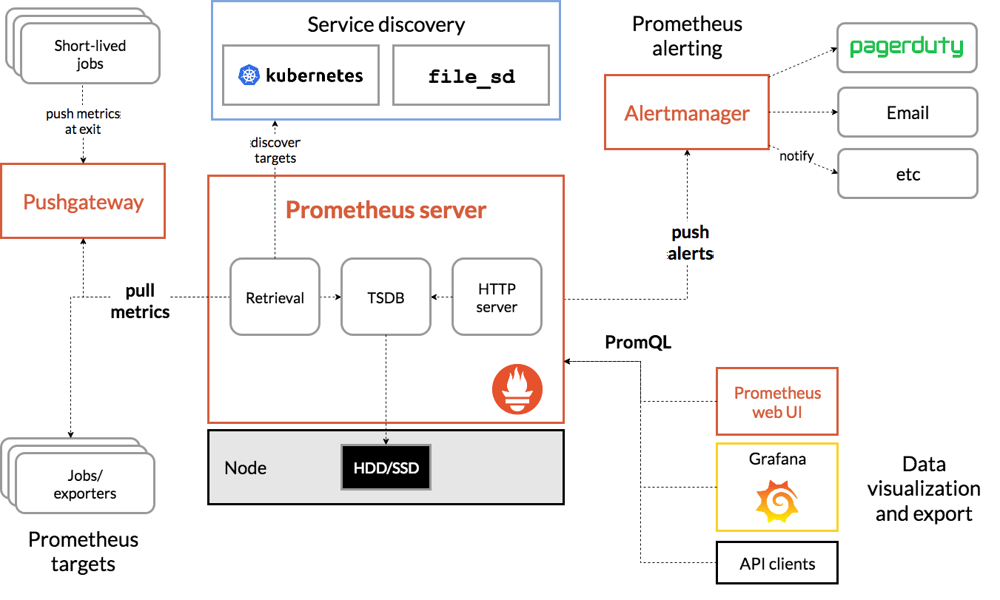

## 시스템 모니터링(Observability)

- Prometheus: Soundcloud에서 만든 오픈소스 시스템 모니터링 및 경고 툴킷
- Grafana: 오픈 소스 시각화 및 분석 소프트웨어로 록 및 추적을 쿼리, 시각화, 경고 및 탐색할 수 있음. 시계열데이터베이스(TSDB) 데이터를 통찰력 있는 그래프와 시각화로 전환하는 도구를 제공
- Loki: Grafana Labs에서 개발한 오픈 소스 프로젝트로, 로그 데이터 집계 시스템. Loki를 통해 수집된 로그 데이터를 Grafana 대시보드에서 시각적으로 분석하고 모니터링


Spring Boot Actuator를 사용하여 /actuator/premetheus 경로로 Promethesus에서 사용할 메트릭 정보를 외부에 노출합니다.
메트릭 정보를 Promethues는 일정시간마다 주기적으로 pull 해와서 수집합니다.
Prometheus에서 수집된 메트릭은 Grafana가 Query를 통하여 사용자가 볼 수 있도록 시각화를 할 때 사용합니다.



referer

- https://junuuu.tistory.com/968

### Prometheus

#### 1. 의존성 추가

gradle

```groovy
implementation 'org.springframework.boot:spring-boot-starter-actuator'
runtimeOnly 'io.micrometer:micrometer-registry-prometheus'
implementation 'com.github.loki4j:loki-logback-appender:2.0.3'
```

maven

```xml
		<dependency>
			<groupId>org.springframework.boot</groupId>
			<artifactId>spring-boot-starter-actuator</artifactId>
		</dependency>
		<dependency>
			<groupId>io.micrometer</groupId>
			<artifactId>micrometer-registry-prometheus</artifactId>
			<scope>runtime</scope>
		</dependency>
		<dependency>
			<groupId>com.github.loki4j</groupId>
			<artifactId>loki-logback-appender</artifactId>
			<version>2.0.3</version>
			<scope>compile</scope>
		</dependency>
```

### Logi

loki-logback-appender를 사용하면 Logback의 설정 파일(logback.xml)에서 Loki와의 연결을 간편하게 설정할 수 있습니다.

```
implementation 'com.github.loki4j:loki-logback-appender:2.0.3'
```

```xml
		<dependency>
			<groupId>com.github.loki4j</groupId>
			<artifactId>loki-logback-appender</artifactId>
			<version>2.0.3</version>
			<scope>compile</scope>
		</dependency>
```

LogBack 설정

```
<configuration>
    <!-- Loki로 로그를 전송하는 Appender 설정 -->
    <appender name="LOKI" class="com.github.loki4j.logback.Loki4jAppender">
        <!-- Loki API URL 설정 -->
        <http>
            <url>http://localhost:3100/loki/api/v1/push</url>
        </http>
        <!-- 로그 포맷과 레이블 설정 -->
        <format>
            <!-- 로그에 레이블 추가 -->
            <label>
                <pattern>app=my-app,host=${HOSTNAME}</pattern>
            </label>
            <!-- 로그 메시지를 JSON 형식으로 포맷 -->
            <message class="com.github.loki4j.logback.JsonLayout" />
        </format>
    </appender>

    <!-- 루트 로거 설정 -->
    <root level="DEBUG">
        <!-- "LOKI" Appender를 루트 로거에 연결 -->
        <appender-ref ref="LOKI" />
    </root>
</configuration>
```
