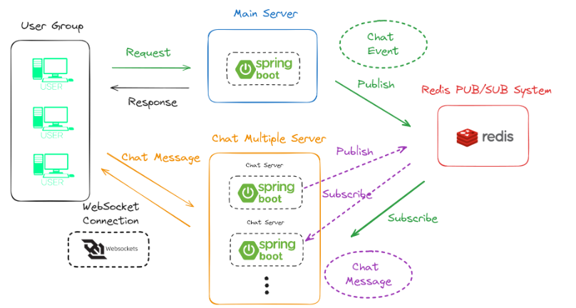
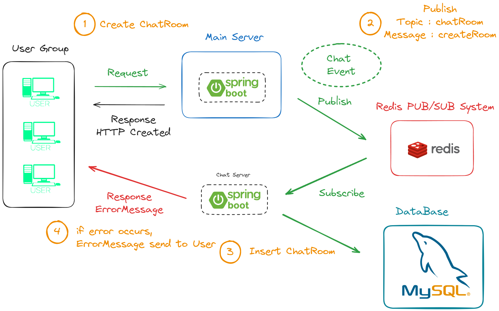
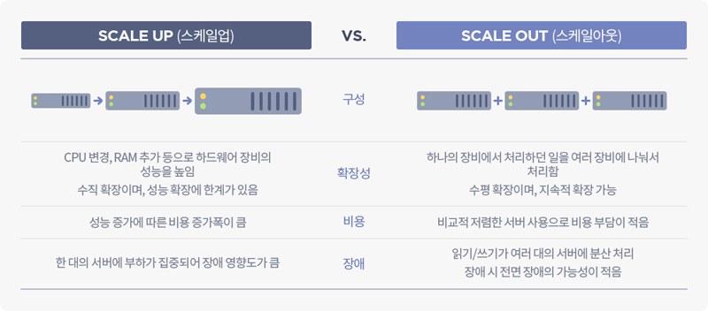

## STOMP

`WebSocket` 프로토콜만을 사용해서 채팅 서버를 구현할 경우 메시지 포맷형식, 메시지 통신 과정, 세션 응을 일일이 관리

`STOMP(Simple Text Oriented Message Protocol)`
은 메시지 송수신을 효율적으로 하기 위해 나온 프로토콜이며 WebSocket 프로토콜 위에서 동작한다. 기본적으로 pub/sub 구조로 되어 있어 메시지 송신이나 수신 처리되는 부분의 확실히 정의되어 있기 때문에 개발자 입장에선 메시징 처리 할 때 STOMP 스펙의 규칙만 잘 지키면 된다.
`pub/sub` 는 서로 직접 통신하는 것이 아닌 Message Broker(미들웨어 역할)를 통해 메시지를 전달하는 구조
Spring STOMP은 서버의 내부 메모리에서 동작하므로 서버가 down 되면 데이터들은 유실될 수 있고 다수의 서버일 경우 서버간 채팅방을 공유할 수 없게 되면서 다른 서버간에 있는 사용자와의 채팅이 불가능해진다.
이러한 문제를 해결하기 위해 `외부 메시지 브로커` 연동한다.
Redis는 STOMP 프로토콜을 지원하지 않지만 Redis pub/sub 기능을 통해 메시지 브로커로 사용할 수 있다.
RabbitMQ는 STOMP 프로토콜을 지원하는 전용 메시지 브로커로서 고도화된 기능(메시지 전달 보장, SSL 지원)을 사용할 수 있다.

## 레디스 pub/sub

Redis PUB/SUB System은 분산 환경에서 메시지 기반 통신을 가능하게 하는 메시지 브로커 기능을 간단하게 구현





[참고](https://velog.io/@ktf1686/Spring-Redis-PUBSUB-WebSocket을-이용한-채팅-서버-구현하기)

### 용도

- JWT 토큰 관리
- 분산서버에서 실시간 채팅
- 분산서버에서 session 저장

### 변화

```
  Polling
Long Polling                                                                                   RabbitMQ
  WebSock    -------------------->   SockJS   ---------------------->   STOMP  ------------->   Redis
              구형 브라우저 호환                  메시지포맷                        분산환경
                                               통신과정/세션 관리                  Scale-out

```

### Redis client

- Jedis
- Lettuce

### Redis Docker

```shell
C:\Users\admin>docker run --name redis -d -p 6379:6379 redis

C:\Users\admin>docker exec -it redis /bin/bash

root@a61c40713ca4:/data# redis-cli -h 127.0.0.1

127.0.0.1:6379> SET hotel:billing-code:1 "123456789"
OK

127.0.0.1:6379> GET hotel:billing-code:1
"123456789"

127.0.0.1:6379> KEYS *
1) "hotel:billing-code:1"

127.0.0.1:6379> quit
```

### 용어

- Polling : 클라이언트가 주기적으로 서버에 새 메시지가 있는지 요청하는 방식. 짧은 주기로 요청하면 서버 부하가 커지고, 긴 주기는 실시간성이 떨어짐
- Long Polling : 클라이언트가 요청하면 서버는 새 메시지가 도착할 때까지 연결을 유지하다가 메시지가 오면 응답하고 연결을 끊는 방식
- WebSock : 클라이언트와 서버 사이에 지속적인 양방향 통신 채널. HTML5 부터 지원됨.
- SockJS :
- STOMP :
- Redis :
- RabbitMQ :

### 스케일업과 스케일아웃 차이

- Scale-up : 기존의 서버를 보다 높은 사양으로 업그레이드 하는 것(Vertical scaling). CPU 나 메모리 업그레이드. AWS EC2 micro -> small- > mediun.
- Scale-out : 장비를 추가해서 확장. 기존 서버만으로 용량이나 성능의 한계에 도달했을 때 비슷한 사양의 서버를 추가로 연결(horizontal scaling).


