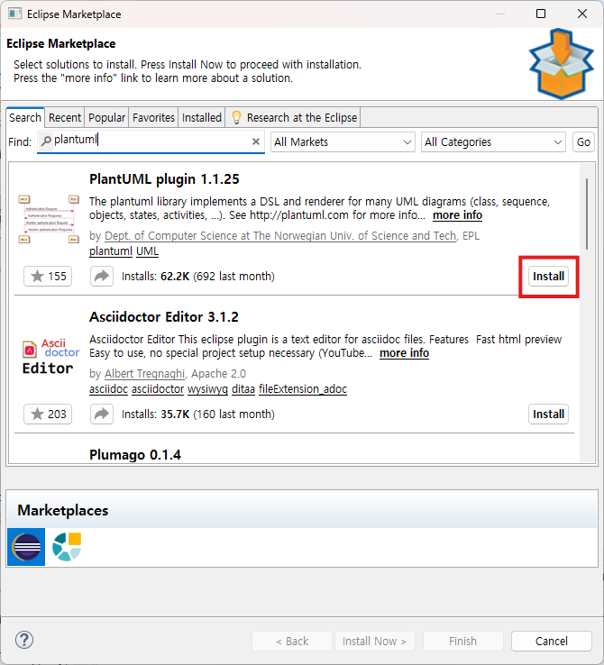
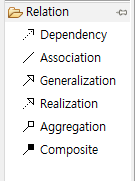

PlantUML 플러그인 설치



```
              +------------------+
              |     Person      |
              +------------------+
              | - name           |
              | - age            |
              +------------------+
              | + getInfo()      |
              +------------------+
                   ▲
         ┌─────────┴─────────┐
         │                   │
+------------------+   +------------------+
|     Student      |   |     Teacher      |
+------------------+   +------------------+
| - studentId      |   | - teacherId      |
+------------------+   +------------------+
| + enroll()       |   | + teach()        |
+------------------+   +------------------+

        ▲                         ▲
        |                         |
        | association             | association
        |                         |
        v                         v

+------------------+     +------------------+
|     Course       |<----|     Teacher      |
+------------------+     +------------------+
| - courseName     |
+------------------+
| + addStudent()   |
+------------------+
        ▲
        |
        | aggregation (집합)
        |
+------------------+
|    Student       |
+------------------+

+------------------+
|     School       |
+------------------+
| - name           |
+------------------+
| + addStudent()   |
| + addTeacher()   |
+------------------+
        ▲
        |
        | composition (포함)
        |
        v
+------------------+
| Student, Teacher |
+------------------+
```



| 관계   | 영어           | 기호       | 핵심 의미       | 예시       |
| ------ | -------------- | ---------- | --------------- | ---------- |
| 의존   | Dependency     | ◀---       | 일시적 사용     | 파라미터   |
| 연관   | Association    | ───        | 단순 참조       | 필드       |
| 상속   | Generalization | ◁──        | is-a 관계       | extends    |
| 실체화 | Realization    | ◁········· | 인터페이스 구현 | implements |
| 집합   | Aggregation    | ◇──        | 약한 포함       | 컬렉션     |
| 포함   | Composition    | ◆──        | 강한 포함       | 생성포함   |

1. ApplocationContext가 실행될 때 설정파일을 읽음
2. @ComponentScan으로 설정된 패키지 경로에 있는 스프링 빈 설정을 로딩
3. 스프링 빈들의 의존성을 검사
4. 하위 모듈에서 상위 모듈 순으로 스프링 빈들 생성하고 순차적으로 스프링 빈 사이에 의존성 주입을 한다.

| 약자 | 이름 | 핵심 의미                    |
| ---- | ---- | ---------------------------- |
| S    | SRP  | 하나의 책임만 가져라         |
| O    | OCP  | 확장에는 열려, 변경에는 닫혀 |
| L    | LSP  | 자식은 부모를 대체 가능해야  |
| I    | ISP  | 인터페이스는 작게 쪼개라     |
| D    | DIP  | 추상화에 의존하라            |
